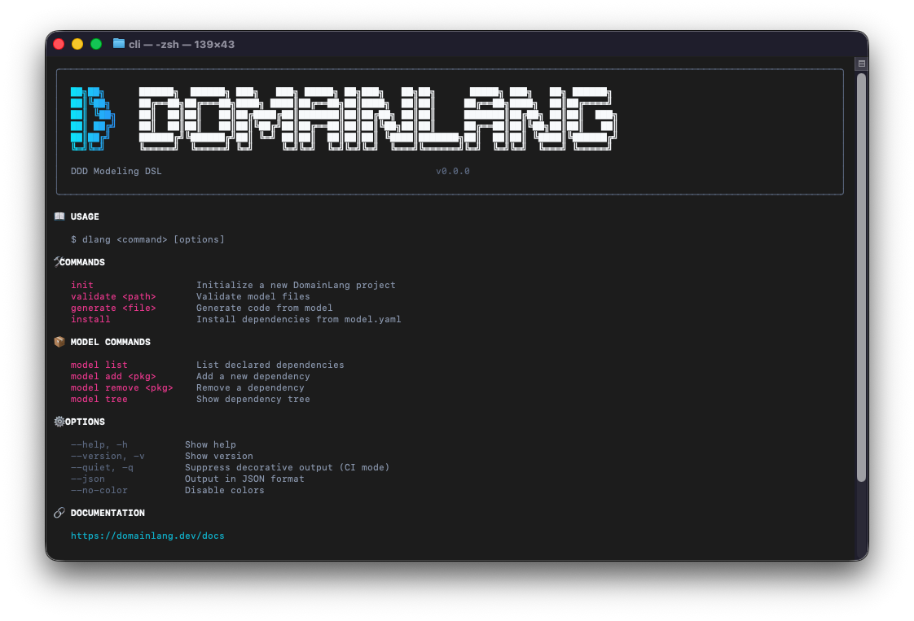

<picture>
  <source media="(prefers-color-scheme: dark)" srcset="images/logo-with-text-light-thin@2x.png">
  <source media="(prefers-color-scheme: light)" srcset="images/logo-with-text-thin@2x.png">
  
</picture>

# A DSL for Domain Driven Design

[](https://github.com/larsbaunwall/DomainLang/actions/workflows/build.yml)
[](https://marketplace.visualstudio.com/items?itemName=thinkability.domain-lang)

> [!WARNING]
> **🚧 Prerelease Software** — DomainLang is in active development and has not reached v1.0 yet. The language syntax and tooling may change. We welcome feedback and contributions—see the [roadmap](https://domainlang.net/roadmap) for planned features.

A small DSL for Domain-Driven Design (DDD) architecture models, with first-class IDE support.

Use DomainLang to keep domains, bounded contexts, ownership, terminology, and context maps close to the codebase (and easy to review in pull requests).



## Quick start

1. Install the VS Code extension: <https://marketplace.visualstudio.com/items?itemName=thinkability.domain-lang>
2. Create a `.dlang` file and start modeling.
3. Use the docs hub for the learning path: [dsl/domain-lang/docs/README.md](dsl/domain-lang/docs/README.md)

```dlang
Classification CoreDomain
Team SalesTeam

Domain Sales {
    description: "Revenue generation and customer acquisition"
    vision: "Make it easy to buy"
}

bc Orders for Sales as CoreDomain by SalesTeam {
    description: "Order lifecycle and orchestration"

    terminology {
        term Order: "A customer's request to purchase"
    }
}

ContextMap SalesLandscape {
    contains Orders
}
```

## Who this is for

- Architects and tech leads who want lightweight, reviewable DDD models
- Teams doing DDD who need a shared ubiquitous language in the repo
- Developers who want IDE feedback while evolving architecture

## What you get

- A DDD-aligned language for architecture models
- VS Code support (syntax highlighting, completion, hover, go-to-definition)
- Validation to catch common modeling issues early
- Model Query SDK for analysis and automation

## Documentation

- Docs hub: [dsl/domain-lang/docs/README.md](dsl/domain-lang/docs/README.md)
- Getting started: [dsl/domain-lang/docs/getting-started.md](dsl/domain-lang/docs/getting-started.md)
- Quick reference: [dsl/domain-lang/docs/quick-reference.md](dsl/domain-lang/docs/quick-reference.md)
- Language reference: [dsl/domain-lang/docs/language.md](dsl/domain-lang/docs/language.md)
- Web docs: <https://larsbaunwall.github.io/DomainLang/index.html>

## Build from source

Development uses Node.js 20 (Volta is configured).

```bash
cd dsl/domain-lang
npm install
npm run langium:generate
npm run build
npm test
```

## Contributing and feedback

Ideas, bug reports, and pull requests are welcome.

- Ask questions and share ideas in Discussions: <https://github.com/larsbaunwall/DomainLang/discussions>
- Report bugs or propose features in Issues: <https://github.com/larsbaunwall/DomainLang/issues>
- Want to contribute code? Start with docs/examples, then run `npm test` and `npm run lint` from `dsl/domain-lang/`.
- Workspace commands and package layout: [dsl/domain-lang/README.md](dsl/domain-lang/README.md)

## License

Apache 2.0 (see LICENSE)
