<p align="center">
  
</p>

<h1 align="center">DomainLang</h1>

<p align="center">
  <strong>Model your architecture. Share your vision. Build with confidence.</strong>
</p>

<p align="center">
  <a href="https://github.com/larsbaunwall/DomainLang/actions/workflows/build.yml"></a>
  <a href="https://marketplace.visualstudio.com/items?itemName=thinkability.domain-lang"></a>
</p>

<p align="center">
  <a href="#-quick-start">Quick Start</a> •
  <a href="./dsl/domain-lang/docs/getting-started.md">Tutorial</a> •
  <a href="./dsl/domain-lang/docs/README.md">Documentation</a> •
  <a href="https://larsbaunwall.github.io/DomainLang/index.html">Try Online</a>
</p>

---

**DomainLang** brings Domain-Driven Design to life through code. Define bounded contexts, capture ubiquitous language, and map integrations—all in a clean, readable syntax that both developers and domain experts can understand.

```mermaid
graph LR
    subgraph Your Architecture
        D["🏛 Domain"] --> BC["📦 Bounded Context"]
        BC --> T["📖 Terminology"]
        BC --> R["🔗 Relationships"]
    end
    
    DL["DomainLang"] -->|"models"| D
    DL -->|"validates"| BC
    DL -->|"documents"| T
```



```dlang
Classification CoreDomain
Team SalesTeam

Domain Sales {
    description: "Revenue generation and customer acquisition"
}

BoundedContext OrderProcessing for Sales as CoreDomain by SalesTeam {
    description: "Handles customer order lifecycle"
    
    terminology {
        term Order: "A customer's request to purchase products"
    }
}
```

---

## Why DomainLang?

| Challenge | Solution |
|-----------|----------|
| **Architecture docs go stale** | Living documentation that evolves with your code |
| **Terminology confusion** | Ubiquitous language captured alongside models |
| **Design drift** | Validation rules catch violations early |
| **Siloed knowledge** | Readable syntax bridges business and tech |

## ✨ Features

- 📝 **Architecture as code** — Express DDD concepts in a clean, readable syntax
- 🔍 **Validation** — Catch design issues early with built-in rules
- 💡 **IDE support** — Syntax highlighting, auto-completion, hover docs, and go-to-definition
- 🤝 **Collaboration** — Shared language between business experts and developers
- 📊 **Visualization** — Generate context maps and diagrams

### 🔌 Model Query SDK

Go beyond documentation—build tools and automation on your architecture:

```typescript
import { loadModel } from 'domain-lang-language/sdk/loader-node';

const { query } = await loadModel('./architecture.dlang');

// Find critical contexts for compliance audits
const criticalContexts = query.boundedContexts()
    .withRole('Core')
    .withTeam('PaymentTeam');

for (const bc of criticalContexts) {
    console.log(`${bc.name}: ${bc.description}`);
}
```

**What you can build:**

- 📊 Compliance reports and architecture metrics
- 🤖 CI/CD checks for architectural governance
- 📈 Team ownership dashboards
- 🔗 Custom visualizations and diagram generators

[→ SDK Documentation](./dsl/domain-lang/packages/language/src/sdk/README.md)

---

## 🚀 Quick Start

### Try It Now

Experience DomainLang instantly in the [**online playground**](https://larsbaunwall.github.io/DomainLang/index.html) — no installation required.

### Install the VS Code Extension

1. Open VS Code Extensions (`Ctrl+Shift+X` / `Cmd+Shift+X`)
2. Search for **"DomainLang"**
3. Click **Install**

### Create Your First Model

Create `my-domain.dlang`:

```dlang
Classification CoreDomain
Team ProductTeam

Domain ECommerce {
    description: "Online shopping platform"
}

BoundedContext Catalog for ECommerce as CoreDomain by ProductTeam {
    description: "Product catalog management"
}

BoundedContext Orders for ECommerce as CoreDomain by ProductTeam {
    description: "Order processing"
}

ContextMap Platform {
    contains Catalog, Orders
    Catalog -> Orders
}
```

**Next:** Follow the [Getting Started tutorial](./dsl/domain-lang/docs/getting-started.md) for a complete walkthrough.

---

## 📖 Learn DomainLang

| When you want to... | Read this |
| ------------------- | --------- |
| Build your first model | [Getting Started](./dsl/domain-lang/docs/getting-started.md) (30 min) |
| Look up syntax quickly | [Quick Reference](./dsl/domain-lang/docs/quick-reference.md) |
| Copy-paste common patterns | [Syntax Examples](./dsl/domain-lang/docs/syntax-examples.md) |
| Understand the full grammar | [Language Reference](./dsl/domain-lang/docs/language.md) |
| Query models programmatically | [SDK Documentation](./dsl/domain-lang/packages/language/src/sdk/README.md) |

[→ Full Documentation Hub](./dsl/domain-lang/docs/README.md)

---

## 🏗️ Project Structure

```text
DomainLang/
├── dsl/domain-lang/           # Core implementation
│   ├── packages/
│   │   ├── language/          # Grammar & language server
│   │   ├── cli/               # Command-line tools
│   │   └── extension/         # VS Code extension
│   ├── docs/                  # Full documentation
│   └── examples/              # Example models
├── adr/                       # Architecture decisions
└── requirements/              # Product requirements
```

---

## 🛠️ Build from Source

```bash
cd dsl/domain-lang
npm install
npm run langium:generate   # Generate from grammar
npm run build              # Compile TypeScript
npm test                   # Run tests
```

The grammar is built with [Langium](https://langium.org/). View the definition: [domain-lang.langium](./dsl/domain-lang/packages/language/src/domain-lang.langium)

---

## 💡 Inspiration

DomainLang builds on ideas from [ContextMapper DSL](https://github.com/ContextMapper/context-mapper-dsl), aiming to provide a more complete DDD specification language—one that works both as diagrams-as-code and as a semantic, compilable architecture model.

---

## 🤝 Contributing

We welcome contributions of all kinds:

- 🐛 **Found a bug?** [Open an issue](https://github.com/larsbaunwall/DomainLang/issues)
- 💡 **Have an idea?** [Start a discussion](https://github.com/larsbaunwall/DomainLang/discussions)
- 📖 **Improve the docs?** PRs are always welcome

---

## 📬 Get in Touch

Have feedback? Questions? I'd love to hear from you—especially if you have experience with language design or domain-driven design.

[Open an issue](https://github.com/larsbaunwall/DomainLang/issues) and I'll respond as soon as possible.

---

## 📄 License

[Apache 2.0](./LICENSE)
