# DomainLang Workspace

> The home of DomainLang—where architecture becomes code.

This monorepo contains everything you need to model, validate, and query Domain-Driven Design architectures.

```mermaid
graph LR
    subgraph You["👤 You"]
        Write["Write .dlang"]
    end
    
    subgraph DomainLang["⚙️ DomainLang"]
        Lang["Language Package"]
        CLI["CLI Tools"]
        Ext["VS Code Extension"]
    end
    
    subgraph Output["📊 Output"]
        Valid["Validated Model"]
        Query["SDK Queries"]
    end
    
    Write --> Lang --> Valid
    Write --> Ext
    Valid --> Query
```



## 🚀 Get Started

| I want to... | Go here |
| ------------ | ------- |
| **Learn the language** | [Getting Started Guide](./docs/getting-started.md) |
| **Look up syntax** | [Quick Reference](./docs/quick-reference.md) |
| **See examples** | [Syntax Examples](./docs/syntax-examples.md) |
| **Understand the grammar** | [Language Reference](./docs/language.md) |

## 📦 Packages

| Package | Purpose |
| ------- | ------- |
| [`language`](./packages/language/README.md) | Core grammar, language server, and [SDK](./packages/language/src/sdk/README.md) |
| [`cli`](./packages/cli/README.md) | Command-line validation and generation |
| [`extension`](./packages/extension/langium-quickstart.md) | VS Code extension for IDE support |
| [`demo`](./packages/demo/README.md) | Browser-based playground |

## 🛠️ Development Commands

```bash
# After editing .langium grammar files
npm run langium:generate

# Build everything
npm run build

# Build only the language package (faster iteration)
npm run build --workspace packages/language

# Run tests
npm test --workspace packages/language
```

## 📁 Repository Layout

```text
dsl/domain-lang/
├── docs/              # Documentation (start here!)
├── examples/          # Sample .dlang models
├── packages/
│   ├── language/      # Grammar, parser, and SDK
│   ├── cli/           # Command-line tools
│   ├── extension/     # VS Code extension
│   └── demo/          # Online playground
└── tsconfig.json      # Shared TypeScript config
```

## 📚 Documentation

All documentation lives in [docs/](./docs):

- **[Getting Started](./docs/getting-started.md)** — Build your first model
- **[Quick Reference](./docs/quick-reference.md)** — Syntax at a glance
- **[Syntax Examples](./docs/syntax-examples.md)** — Copy-paste patterns
- **[Language Reference](./docs/language.md)** — Complete grammar specification

For design decisions and deep dives, see [docs/design-docs/](./docs/design-docs/).

## ⚡ Quick Tips

- Always run `npm run langium:generate` after editing the grammar
- Use `npm run build --workspace packages/language` for faster iteration
- Browse [examples/](./examples) for real-world modeling patterns
