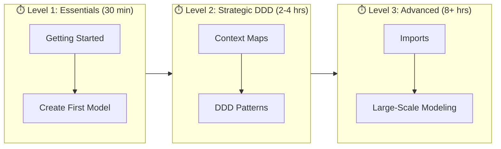

# DomainLang Documentation

Welcome to the DomainLang documentation! Whether you're a software architect modeling complex systems or a domain expert collaborating with developers, you'll find everything you need to start modeling your domain-driven designs.

> **📋 Audience:** Everyone—this is your navigation hub to find the right documentation for your needs.

> **DomainLang** is a domain-specific language (DSL) for describing software architectures using Domain-Driven Design principles. Think of it as "architecture as code"—you write models in a clean, readable syntax, validate them with tooling, and generate artifacts for your teams.

---

## 🚀 Quick Start

**New to DomainLang?** Follow this path:

1. 📖 **[Getting Started Guide](./getting-started.md)** — Build your first model in 30 minutes
2. 📋 **[Quick Reference](./quick-reference.md)** — Keep this open while you work
3. 📚 **[Syntax Examples](./syntax-examples.md)** — Copy-paste patterns for common scenarios

---

## 🎯 Find What You Need

<details>
<summary><strong>I want to learn DomainLang</strong></summary>

| Resource | Best For |
|----------|----------|
| [Getting Started](./getting-started.md) | Hands-on tutorial for beginners |
| [Quick Reference](./quick-reference.md) | Syntax cheat sheet |
| [Syntax Examples](./syntax-examples.md) | All features with examples |
| [Language Reference](./language.md) | Complete grammar specification |

</details>

<details>
<summary><strong>I want to see real examples</strong></summary>

| Example | Domain |
|---------|--------|
| [Customer-Facing Platform](../examples/customer-facing.dlang) | E-commerce |
| [Banking System](../examples/banking-system.dlang) | Finance |
| [Healthcare System](../examples/healthcare-system.dlang) | Healthcare |
| [Multi-Reference Demo](../examples/multi-reference-demo.dlang) | Advanced features |

</details>

<details>
<summary><strong>I want to understand DDD concepts</strong></summary>

- [DDD Compliance Audit](./design-docs/DDD_COMPLIANCE_AUDIT.md) — How DomainLang aligns with DDD
- [Context Maps](./language.md#context-maps-and-relationships) — Modeling system relationships
- [Namespaces](./language.md#namespaces) — Organizing large models

</details>

<details>
<summary><strong>I want to contribute</strong></summary>

- [Grammar Review](./design-docs/GRAMMAR_REVIEW_2025.md) — Language design rationale
- [JSDoc Migration](./design-docs/GRAMMAR_JSDOC_MIGRATION.md) — Documentation approach
- [Main README](../README.md) — Project setup

</details>

---

## 📖 Learning Path

Choose your pace based on your goals:



### Level 1: Essentials (30 minutes)

**Goal:** Create your first domain model.

1. Read [Getting Started](./getting-started.md) Steps 1–4
2. Create a simple domain with one bounded context
3. Add terminology and team ownership
4. Keep [Quick Reference](./quick-reference.md) open for syntax help

**You'll learn:** Domain, BoundedContext, Team, Classifications, basic properties

---

### Level 2: Strategic DDD (2–4 hours)

**Goal:** Model complex systems with multiple contexts.

1. Complete [Getting Started](./getting-started.md) Steps 5–7
2. Study [Syntax Examples – Context Maps](./syntax-examples.md#context-maps)
3. Review the [Banking Example](../examples/banking-system.dlang)
4. Read the [DDD Compliance Audit](./design-docs/DDD_COMPLIANCE_AUDIT.md)

**You'll learn:** Context Maps, Relationships, DDD patterns (OHS, ACL, SK), strategic design

---

### Level 3: Advanced (8+ hours)

**Goal:** Master imports, namespaces, and large-scale modeling.

1. Read [Language Reference – Imports](./language.md#imports)
2. Study the [Healthcare Example](../examples/healthcare-system.dlang)
3. Learn [Multi-Reference](./design-docs/MULTIREFERENCE_EXPLAINED.md)
4. Read [Grammar Review](./design-docs/GRAMMAR_REVIEW_2025.md)
5. Explore workspace management in [Main README](../README.md)

**You'll learn:** Imports, namespaces, governance, dependency management, advanced patterns

---

## 📂 Documentation Map

```text
docs/
├── README.md                    ← You are here (navigation hub)
├── getting-started.md           ← Start here (hands-on tutorial)
├── quick-reference.md           ← Syntax cheat sheet
├── syntax-examples.md           ← All features with examples
├── language.md                  ← Complete grammar reference
│
└── design-docs/                 ← Deep dives and design decisions
    ├── DDD_COMPLIANCE_AUDIT.md      DDD best practices
    ├── MULTIREFERENCE_EXPLAINED.md  Advanced feature guide
    ├── GRAMMAR_REVIEW_2025.md       Language design rationale
    └── ...                          Additional design documents

examples/
├── customer-facing.dlang        ← E-commerce example
├── banking-system.dlang         ← Banking example
├── healthcare-system.dlang      ← Healthcare example
└── multi-reference-demo.dlang   ← Advanced features
```

---

## 🆘 Common Questions

### How do I define a domain?

```dlang
Domain Sales {
    description: "Handles all sales operations"
}
```

→ [Getting Started – Step 1](./getting-started.md#step-1-define-your-first-domain)

### How do I create a bounded context?

```dlang
BC Orders for Sales {
    description: "Order processing"
}
```

→ [Getting Started – Step 2](./getting-started.md#step-2-add-a-bounded-context)

### How do I show relationships between contexts?

```dlang
ContextMap System {
    contains Orders, Catalog
    Catalog -> Orders
}
```

→ [Syntax Examples – Context Maps](./syntax-examples.md#context-maps)

### How do I import from another file?

```dlang
import "./shared.dlang"
import "~/contexts/sales.dlang"
import "owner/repo@v1.0.0" as External
```

→ [Language Reference – Imports](./language.md#imports)

### What's the difference between Domain and BoundedContext?

| Concept | Purpose | Examples |
| ------- | ------- | -------- |
| **Domain** | Strategic business area | Sales, Marketing, Support |
| **BoundedContext** | Model boundary with clear ownership | Orders, Catalog, Checkout |

→ [Getting Started](./getting-started.md) for detailed explanation

### How do I document ubiquitous language?

```dlang
BC Orders {
    terminology {
        term Order: "Customer purchase request"
            aka: PurchaseOrder
            examples: "Order #12345"
    }
}
```

→ [Getting Started – Step 3](./getting-started.md#step-3-add-terminology)

---

## 🛠️ Tools & IDE Support

### VS Code Extension

Get the best editing experience with our VS Code extension:

- ✨ Syntax highlighting
- 🔍 Auto-completion
- 💡 Hover documentation
- 🔗 Go-to-definition
- ⚡ Real-time validation

→ See [Main README](../README.md) for installation

### CLI Commands

```bash
domainlang validate model.dlang    # Validate your model
domainlang generate model.dlang    # Generate artifacts
```

→ See [Main README](../README.md) for CLI documentation

---

## 📝 Contributing

We'd love your help making DomainLang better!

- 🐛 **Found a bug?** [Open an issue](https://github.com/larsbaunwall/domainlang/issues)
- 💡 **Have an idea?** [Start a discussion](https://github.com/larsbaunwall/domainlang/discussions)
- 📖 **Improve docs?** PRs are always welcome!

→ See [Main README](../README.md) for contribution guidelines

---

## 🔗 Learn More About DDD

- 📘 [Domain-Driven Design by Eric Evans](https://www.domainlanguage.com/ddd/) — The foundational text
- 📗 [Implementing Domain-Driven Design by Vaughn Vernon](https://vaughnvernon.com/implementing-domain-driven-design/) — Practical implementation guide
- 📄 [Context Mapping](https://www.infoq.com/articles/ddd-contextmapping/) — Understanding strategic design
- 🔧 [Langium Documentation](https://langium.org/docs/) — The framework behind DomainLang

---

## 📞 Need Help?

| Resource | Link |
| -------- | ---- |
| 📖 Documentation | You're reading it! |
| 📁 Examples | [examples/](../examples/) |
| 🐛 Issues | [GitHub Issues](https://github.com/larsbaunwall/domainlang/issues) |
| 💬 Discussions | [GitHub Discussions](https://github.com/larsbaunwall/domainlang/discussions) |

---

**Happy modeling!** 🎉
