# DomainLang Documentation

> Your guide to modeling software architecture with Domain-Driven Design.

Whether you're a software architect untangling complex systems or a domain expert bridging the gap with developers, you're in the right place. DomainLang transforms the way teams communicate about architecture—making it executable, shareable, and always up to date.

---

## 🎯 Start Here

```mermaid
flowchart LR
    A["📖 Getting Started"] --> B["📋 Quick Reference"]
    B --> C["📝 Syntax Examples"]
    C --> D["📚 Language Reference"]
    
    style A fill:#e1f5fe
    style D fill:#f3e5f5
```



**New to DomainLang?** Follow this path:

1. **[Getting Started](./getting-started.md)** — Build your first model in 30 minutes
2. **[Quick Reference](./quick-reference.md)** — Keep open while you work
3. **[Syntax Examples](./syntax-examples.md)** — Copy-paste patterns for common scenarios

---

## 📚 Find What You Need

### Learning Resources

| Resource | Best For |
| -------- | -------- |
| [Getting Started](./getting-started.md) | Hands-on tutorial for beginners |
| [Quick Reference](./quick-reference.md) | Syntax cheat sheet |
| [Syntax Examples](./syntax-examples.md) | All features with examples |
| [Language Reference](./language.md) | Complete grammar specification |

### Real-World Examples

| Example | Domain |
| ------- | ------ |
| [Customer-Facing Platform](../examples/customer-facing.dlang) | E-commerce |
| [Banking System](../examples/banking-system.dlang) | Finance |
| [Healthcare System](../examples/healthcare-system.dlang) | Healthcare |
| [Multi-Reference Demo](../examples/multi-reference-demo.dlang) | Advanced features |

### DDD Concepts

- [DDD Compliance Audit](./design-docs/DDD_COMPLIANCE_AUDIT.md) — How DomainLang aligns with DDD
- [Context Maps](./language.md#context-maps-and-relationships) — Modeling system relationships
- [Namespaces](./language.md#namespaces) — Organizing large models

### Contributing

- [Grammar Review](./design-docs/GRAMMAR_REVIEW_2025.md) — Language design rationale
- [JSDoc Migration](./design-docs/GRAMMAR_JSDOC_MIGRATION.md) — Documentation approach
- [Main README](../README.md) — Project setup

---

## Learning Path

Pick your adventure based on where you are in your DDD journey:

```mermaid
graph TB
    subgraph Level1["🌱 Level 1: Essentials"]
        L1A["30 minutes"]
        L1B["Domain + Context + Team"]
    end
    
    subgraph Level2["🌿 Level 2: Strategic DDD"]
        L2A["2-4 hours"]
        L2B["Context Maps + Patterns"]
    end
    
    subgraph Level3["🌳 Level 3: Advanced"]
        L3A["8+ hours"]
        L3B["Imports + Namespaces"]
    end
    
    Level1 --> Level2 --> Level3
```



### Level 1: Essentials (30 min)

**Goal:** Create your first domain model.

1. Read [Getting Started](./getting-started.md) Steps 1–4
2. Create a simple domain with one bounded context
3. Add terminology and team ownership

**You'll learn:** Domain, BoundedContext, Team, Classifications, basic properties

### Level 2: Strategic DDD (2–4 hours)

**Goal:** Model complex systems with multiple contexts.

1. Complete [Getting Started](./getting-started.md) Steps 5–7
2. Study [Syntax Examples – Context Maps](./syntax-examples.md#context-maps)
3. Review the [Banking Example](../examples/banking-system.dlang)

**You'll learn:** Context Maps, Relationships, DDD patterns (OHS, ACL, SK)

### Level 3: Advanced (8+ hours)

**Goal:** Master imports, namespaces, and large-scale modeling.

1. Read [Language Reference – Imports](./language.md#imports)
2. Study the [Healthcare Example](../examples/healthcare-system.dlang)
3. Explore [Multi-Reference](./design-docs/MULTIREFERENCE_EXPLAINED.md)

**You'll learn:** Imports, namespaces, governance, multi-file models

---

## 📂 Documentation Map

```text
docs/
├── README.md              ← You are here
├── getting-started.md     ← Hands-on tutorial
├── quick-reference.md     ← Syntax cheat sheet
├── syntax-examples.md     ← Copy-paste patterns
├── language.md            ← Complete grammar reference
└── design-docs/           ← Deep dives

examples/
├── customer-facing.dlang  ← E-commerce
├── banking-system.dlang   ← Finance
├── healthcare-system.dlang ← Healthcare
└── multi-reference-demo.dlang ← Advanced patterns
```

---

## ❓ Quick Answers

### How do I define a domain?

```dlang
Domain Sales {
    description: "Handles all sales operations"
}
```

### How do I create a bounded context?

```dlang
Domain Sales { description: "Sales domain" }

bc Orders for Sales {
    description: "Order processing"
}
```

### How do I show relationships?

```dlang
ContextMap System {
    contains Catalog, Orders
    Catalog -> Orders
}
```

### How do I import from another file?

```dlang
import "./shared.dlang"
import "owner/repo@v1.0.0" as External
```

→ More in [Quick Reference](./quick-reference.md)

---

## 🛠️ IDE Support

The VS Code extension provides:

- ✨ Syntax highlighting
- 🔍 Auto-completion
- 💡 Hover documentation
- 🔗 Go-to-definition
- ⚡ Real-time validation

Search "DomainLang" in VS Code Extensions to install.

---

## 📖 Further Reading

**DDD Resources:**

- [Domain-Driven Design](https://www.domainlanguage.com/ddd/) by Eric Evans
- [Implementing DDD](https://vaughnvernon.com/implementing-domain-driven-design/) by Vaughn Vernon
- [Context Mapping](https://www.infoq.com/articles/ddd-contextmapping/) on InfoQ

**Technical:**

- [Langium Documentation](https://langium.org/docs/) — The framework behind DomainLang

---

## 🤝 Get Involved

- 🐛 [Report a bug](https://github.com/larsbaunwall/domainlang/issues)
- 💡 [Request a feature](https://github.com/larsbaunwall/domainlang/discussions)
- 📖 [Improve the docs](https://github.com/larsbaunwall/domainlang)

---

**Happy modeling!** 🎉
