# Getting Started with DomainLang

Welcome! This hands-on tutorial will guide you from zero to your first domain model in about 30 minutes.

> **📋 Audience:** Software architects, domain experts, and developers new to DomainLang. No prior DDD experience required.

---

## What You'll Build

By the end of this tutorial, you'll have created a complete domain model for an online bookstore:

```mermaid
graph TB
    subgraph Domain["📦 Bookstore Domain"]
        BC1["📋 Catalog Context"]
        BC2["📋 OrderManagement Context"]
        BC3["📋 Shipping Context"]
    end
    
    BC1 -->|"provides books"| BC2
    BC2 -->|"triggers fulfillment"| BC3
    
    T1["👥 CatalogTeam"] -.->|owns| BC1
    T2["👥 OrderTeam"] -.->|owns| BC2
    T3["👥 ShippingTeam"] -.->|owns| BC3
```



---

## What is DomainLang?

DomainLang is a Domain-Driven Design (DDD) modeling language that lets you describe your software architecture as executable specifications. Think of it as "architecture as code"—you write models in a clean DSL, validate them with tooling, and generate artifacts for your teams.

**Why use DomainLang?**

- 📝 **Executable documentation** — Your architecture stays up-to-date
- 🔍 **Validation** — Catch design issues early
- 🤝 **Collaboration** — Shared language between business and tech
- 🔄 **Consistency** — Enforce patterns across teams

---

## Who is This For?

- 🏗️ **Software architects** designing domain-driven systems
- 💼 **Domain experts** collaborating with technical teams
- 👥 **Development teams** implementing DDD patterns
- 📚 **Anyone** who wants to model complex business domains clearly

---

## Prerequisites

Before you begin, make sure you have:

- ✅ Node.js 18 or higher installed
- ✅ A text editor (VS Code recommended for the best experience)
- ✅ Basic understanding of software architecture (helpful but not required)

---

## Installation

Let's get DomainLang set up on your machine.

Navigate to the repository root and install dependencies:

```bash
cd dsl/domain-lang
npm install
```

Generate the language parser:

```bash
npm run langium:generate
```

Build all packages:

```bash
npm run build
```

> 💡 **Tip:** For faster iteration when working on the grammar, target the language package directly:
>
> ```bash
> npm run build --workspace packages/language
> npm test --workspace packages/language
> ```

---

## Your First Model: A Bookstore

Let's build a domain model for an online bookstore, step by step. Create a new file called `bookstore.dlang` and follow along.

### Step 1: Define Your First Domain

A **Domain** represents a sphere of knowledge or business activity. It's the highest-level concept in DDD.

```dlang
Domain Bookstore {
    description: "Online bookstore for selling books"
    vision: "Make books accessible to everyone online"
}
```

**What's happening here:**

| Element | Purpose |
| ------- | ------- |
| `Domain` | Keyword that starts a domain declaration |
| `Bookstore` | The name of your domain |
| `{ }` | Contains the domain's documentation |
| `description` | Brief explanation of what this domain does |
| `vision` | Long-term goal that guides decisions |

> 💡 **DDD Insight:** A domain is a "sphere of knowledge." In a company, you might have domains like Sales, Marketing, Shipping, and Customer Support—each with its own rules and language.

---

### Step 2: Add a Bounded Context

A **Bounded Context** is a boundary within which a specific model is defined and consistent. It's one of the most important patterns in DDD.

```dlang
Domain Bookstore {
    description: "Online bookstore for selling books"
    vision: "Make books accessible to everyone online"
}

BoundedContext Catalog for Bookstore {
    description: "Manages the book catalog and inventory"
}
```

**What's happening here:**

| Element | Purpose |
| ------- | ------- |
| `BoundedContext` | Declares a bounded context (shorthand: `BC`) |
| `Catalog` | The context name |
| `for Bookstore` | Links this context to the Bookstore domain |

> 💡 **DDD Insight:** Within a bounded context, terms like "Order" or "Customer" have precise, consistent meanings. The same term might mean something different in another context—and that's okay!

---

### Step 3: Add Terminology

Define the **ubiquitous language**—the common vocabulary your team uses:

```dlang
BoundedContext Catalog for Bookstore {
    description: "Manages the book catalog and inventory"

    terminology {
        term Book: "A published work available for purchase"
            examples: "The Great Gatsby", "1984"

        term ISBN: "International Standard Book Number"
            aka: BookIdentifier
    }
}
```

**What's happening here:**

| Element | Purpose |
| ------- | ------- |
| `terminology` | Block containing domain terms |
| `term Name: "description"` | Defines a term with its meaning |
| `examples` | Concrete instances of the term |
| `aka` | Synonyms (also known as) |

> 💡 **DDD Insight:** The ubiquitous language is shared by everyone—developers, domain experts, and stakeholders. When everyone uses the same terms, misunderstandings decrease dramatically.

---

### Step 4: Add Team Ownership

Track who owns this context—this helps with Conway's Law alignment:

```dlang
Team CatalogTeam

BoundedContext Catalog for Bookstore by CatalogTeam {
    description: "Manages the book catalog and inventory"

    terminology {
        term Book: "A published work available for purchase"
            examples: "The Great Gatsby", "1984"

        term ISBN: "International Standard Book Number"
            aka: BookIdentifier
    }
}
```

**What's happening here:**

| Element | Purpose |
| ------- | ------- |
| `Team` | Declares a team (usually outside the context) |
| `by CatalogTeam` | Assigns ownership to the context |

> 💡 **Why ownership matters:** Clear ownership prevents the "tragedy of the commons" where nobody takes responsibility. It also aligns with Conway's Law—your architecture tends to mirror your organization's communication structure.

---

### Step 5: Add Another Context

Let's add an order management context to make things more interesting:

```dlang
Domain Bookstore {
    description: "Online bookstore for selling books"
    vision: "Make books accessible to everyone online"
}

Team CatalogTeam
Team OrderTeam

BoundedContext Catalog for Bookstore by CatalogTeam {
    description: "Manages the book catalog and inventory"

    terminology {
        term Book: "A published work available for purchase"
        term ISBN: "International Standard Book Number"
            aka: BookIdentifier
    }
}

BoundedContext OrderManagement for Bookstore by OrderTeam {
    description: "Handles customer orders and fulfillment"

    terminology {
        term Order: "Customer request to purchase books"
        term OrderLine: "Single book in an order"
    }
}
```

### Step 6: Create a Context Map

Now let's visualize how your bounded contexts relate to each other. A **Context Map** shows the integration landscape:

```dlang
ContextMap BookstoreSystem {
    contains Catalog, OrderManagement

    Catalog -> OrderManagement
}
```

**What's happening here:**

| Element | Purpose |
| ------- | ------- |
| `ContextMap` | Defines relationships between contexts |
| `contains` | Lists the contexts in this map |
| `->` | Shows a dependency (Catalog → OrderManagement) |

The arrow `->` indicates that Catalog is "upstream" and OrderManagement is "downstream"—meaning OrderManagement depends on data or services from Catalog.

```mermaid
graph LR
    subgraph BookstoreSystem
        A["📋 Catalog"] -->|"provides books"| B["📋 OrderManagement"]
    end
```



---

### Step 7: Add Strategic Patterns

Mark contexts with DDD patterns to indicate their strategic importance:

```dlang
Classification CoreDomain
Classification SupportingDomain

BoundedContext Catalog for Bookstore as CoreDomain by CatalogTeam {
    description: "Manages the book catalog and inventory"

    terminology {
        term Book: "A published work available for purchase"
        term ISBN: "International Standard Book Number"
    }
}

BoundedContext OrderManagement for Bookstore as CoreDomain by OrderTeam {
    description: "Handles customer orders and fulfillment"

    terminology {
        term Order: "Customer request to purchase books"
        term OrderLine: "Single book in an order"
    }
}
```

**What's happening here:**

| Element | Purpose |
| ------- | ------- |
| `Classification` | Creates reusable strategic labels |
| `as CoreDomain` | Marks this as a core business capability |

> 💡 **DDD Insight:** Strategic classification helps prioritize investment:
>
> - **Core Domain:** Your competitive advantage—invest heavily here
> - **Supporting Domain:** Necessary but not differentiating
> - **Generic Domain:** Commodity functionality—consider buying

---

### Step 8: Organize with Namespaces

As your model grows, namespaces help keep things organized:

```dlang
Namespace Bookstore.Core {
    BoundedContext Catalog for Bookstore as CoreDomain by CatalogTeam { }
    BoundedContext OrderManagement for Bookstore as CoreDomain by OrderTeam { }
}

Namespace Bookstore.Supporting {
    BoundedContext Shipping for Bookstore as SupportingDomain by ShippingTeam { }
}
```

**What's happening here:**

| Element | Purpose |
| ------- | ------- |
| `namespace` | Creates a hierarchical container |
| Dotted name | Prefixes all contained elements (e.g., `Bookstore.Core.Catalog`) |

> 💡 **Organization tip:** Namespaces can mirror your organizational structure, deployment units, or strategic groupings. Use whatever makes sense for your team.

---

## Complete Example

Here's the full bookstore model:

```dlang
// Shared Classifications
Classification CoreDomain
Classification SupportingDomain

// Decision Categories
Classification Technical
Classification Business

// Main Domain
Domain Bookstore {
    description: "Online bookstore for selling books"
    vision: "Make books accessible to everyone online"
}

// Teams
Team CatalogTeam
Team OrderTeam
Team ShippingTeam

Namespace Bookstore.Core {
    BoundedContext Catalog for Bookstore as CoreDomain by CatalogTeam {
        description: "Manages the book catalog and inventory"

        terminology {
            term Book: "A published work available for purchase"
                examples: "The Great Gatsby", "1984"

            term ISBN: "International Standard Book Number"
                aka: BookIdentifier

            term Author: "Person who wrote the book"
        }

        decisions {
            decision [Technical] UseElasticsearch: "Use Elasticsearch for book search"
            policy [Business] NoUsedBooks: "Only sell new books"
        }
    }

    BoundedContext OrderManagement for Bookstore as CoreDomain by OrderTeam {
        description: "Handles customer orders and fulfillment"

        terminology {
            term Order: "Customer request to purchase books"
            term OrderLine: "Single book in an order"
            term ShoppingCart: "Temporary collection of books before checkout"
        }

        decisions {
            policy [Business] FreeShippingOver50: "Free shipping for orders over $50"
        }
    }
}

Namespace Bookstore.Supporting {
    BoundedContext Shipping for Bookstore as SupportingDomain by ShippingTeam {
        description: "Manages shipping and delivery"

        terminology {
            term Shipment: "Physical delivery of an order"
            term TrackingNumber: "Unique identifier for tracking a shipment"
        }
    }
}

// Context Map
ContextMap BookstoreSystem {
    contains Bookstore.Core.Catalog, Bookstore.Core.OrderManagement, Bookstore.Supporting.Shipping

    Bookstore.Core.Catalog -> Bookstore.Core.OrderManagement
    Bookstore.Core.OrderManagement -> Bookstore.Supporting.Shipping
}
```

## Validate Your Model

Let's make sure everything is correct! Run validation:

```bash
npm test --workspace packages/language
```

Or use the CLI (if installed):

```bash
domainlang validate bookstore.dlang
```

---

## 🎉 What You Learned

Congratulations! You've built your first domain model. Here's what you now know:

| Concept | What It Does |
| ------- | ------------ |
| **Domains** | Define strategic business areas |
| **Bounded Contexts** | Create model boundaries with clear ownership |
| **Terminology** | Document the ubiquitous language |
| **Teams** | Track ownership for Conway's Law alignment |
| **Classifications** | Mark strategic importance (Core/Supporting/Generic) |
| **Context Maps** | Show how contexts integrate |
| **Decisions** | Record architectural choices |
| **Namespaces** | Organize large models hierarchically |

---

## Next Steps

### 📖 Deepen Your Knowledge

| Resource | What You'll Learn |
| -------- | ----------------- |
| [Language Reference](./language.md) | Complete syntax including imports and relationships |
| [Syntax Examples](./syntax-examples.md) | Copy-paste patterns for common scenarios |
| [Quick Reference](./quick-reference.md) | Keep this open while modeling |

### 🔍 Explore Real Examples

| Example | Domain |
| ------- | ------ |
| [customer-facing.dlang](../examples/customer-facing.dlang) | E-commerce platform |
| [banking-system.dlang](../examples/banking-system.dlang) | Financial services |
| [healthcare-system.dlang](../examples/healthcare-system.dlang) | Healthcare |

### 🛠️ Set Up Your Editor

Install the **DomainLang VS Code extension** for the best experience:

- ✨ Syntax highlighting
- 🔍 Auto-completion
- 💡 Hover documentation
- 🔗 Go-to-definition
- ⚡ Real-time validation

### 📚 Learn Strategic DDD

Read the [DDD Compliance Guide](./design-docs/DDD_COMPLIANCE_AUDIT.md) to understand:

- Core vs Supporting vs Generic subdomains
- Context mapping patterns
- Strategic design principles

### 🚀 Advanced Topics

Once you're comfortable with the basics:

- [Git-native imports](./language.md#imports) for sharing models across repositories
- [Governance policies](./language.md#decisions-policies-and-rules) for compliance documentation

---

## ⚠️ Common Pitfalls

Here are some mistakes to avoid:

### Forgetting Domain Association

```dlang
// ❌ Missing domain association
BoundedContext Orders {
    description: "Where does this belong?"
}

// ✅ Linked to a domain
BoundedContext Orders for Sales {
    description: "Now it's clear!"
}
```

### Missing Colon in Terminology

```dlang
// ❌ Missing colon
terminology {
    term Book "A book"
}

// ✅ Correct syntax
terminology {
    term Book: "A book"
}
```

### Forgetting `contains` in Context Maps

```dlang
// ❌ Contexts not declared
ContextMap System {
    Catalog -> Orders
}

// ✅ Declare contexts first
ContextMap System {
    contains Catalog, Orders
    Catalog -> Orders
}
```

---

## Need Help?

| Resource | Link |
| -------- | ---- |
| 📖 Complete syntax | [Language Reference](./language.md) |
| 📋 Quick lookup | [Quick Reference](./quick-reference.md) |
| 📁 Examples | [examples/](../examples/) |
| 💬 Questions | [GitHub Discussions](https://github.com/larsbaunwall/domainlang/discussions) |

---

## We Welcome Your Feedback

This tutorial is a living document. If something was unclear or you got stuck, please [open an issue](https://github.com/larsbaunwall/domainlang/issues) with:

- What you were trying to do
- What happened instead
- What would have helped

**Happy modeling!** 🎉
