# Getting Started with DomainLang

Build your first domain model in 30 minutes.

> **Who is this for?** Software architects, domain experts, and developers who want to model DDD architectures. No prior DDD experience required.

---

## What You'll Build

By the end of this tutorial, you'll have a complete domain model for an online bookstore with multiple bounded contexts, team ownership, and strategic classifications.


---

## Why DomainLang?

| Without DomainLang | With DomainLang |
| ------------------ | --------------- |
| Architecture docs go stale | Living documentation in code |
| Terminology confusion across teams | Ubiquitous language captured in one place |
| Design decisions lost in wikis | Decisions live alongside the model |
| Manual validation of designs | Automated validation with real-time feedback |

---

## Prerequisites

Before you begin:

- ✅ **Node.js 18+** installed
- ✅ **VS Code** (recommended) or any text editor
- ✅ Basic understanding of software architecture (helpful but not required)

---

## Installation

Navigate to the repository and install dependencies:

```bash
cd dsl/domain-lang
npm install
npm run langium:generate
npm run build
```

> 💡 **Pro tip:** For faster iteration, build only the language package:
>
> ```bash
> npm run build --workspace packages/language
> ```

---

## Step 1: Define Your First Domain

A **Domain** is a sphere of knowledge or business activity—the highest-level concept in DDD.

Create a file called `bookstore.dlang` and add:

```dlang
Domain Bookstore {
    description: "Online bookstore for selling books"
    vision: "Make books accessible to everyone online"
}
```

| Element | Purpose |
| ------- | ------- |
| `Domain` | Keyword declaring a domain |
| `Bookstore` | Your domain's name |
| `description` | What this domain does |
| `vision` | Long-term goal that guides decisions |

> **DDD Insight:** A domain is a "sphere of knowledge." In a company, domains might include Sales, Marketing, Shipping—each with its own rules and language.

---

## Step 2: Add a Bounded Context

A **Bounded Context** is a boundary within which a specific model is defined. It's one of DDD's most important patterns.

```dlang
Domain Bookstore {
    description: "Online bookstore for selling books"
    vision: "Make books accessible to everyone online"
}

BoundedContext Catalog for Bookstore {
    description: "Manages the book catalog and inventory"
}
```

| Element | Purpose |
| ------- | ------- |
| `BoundedContext` | Declares a bounded context (shorthand: `bc`) |
| `Catalog` | Context name |
| `for Bookstore` | Links context to the Bookstore domain |

> **DDD Insight:** Within a bounded context, terms like "Order" or "Customer" have precise, consistent meanings. The same term might mean something different in another context—and that's okay!

---

## Step 3: Add Terminology

Define the **ubiquitous language**—the shared vocabulary your team uses:

```dlang
Domain Bookstore {
    description: "Online bookstore for selling books"
    vision: "Make books accessible to everyone online"
}

BoundedContext Catalog for Bookstore {
    description: "Manages the book catalog and inventory"

    terminology {
        term Book: "A published work available for purchase"
            examples: "The Great Gatsby", "1984"

        term ISBN: "International Standard Book Number"
            aka: BookIdentifier
    }
}
```

| Element | Purpose |
| ------- | ------- |
| `terminology` | Block containing domain terms |
| `term Name: "description"` | Defines a term with its meaning |
| `examples` | Concrete instances |
| `aka` | Synonyms (also known as) |

> **DDD Insight:** The ubiquitous language is shared by everyone—developers, domain experts, and stakeholders. Same terms = fewer misunderstandings.

---

## Step 4: Add Team Ownership

Track who owns this context—essential for Conway's Law alignment:

```dlang
Domain Bookstore {
    description: "Online bookstore for selling books"
}

Team CatalogTeam

BoundedContext Catalog for Bookstore by CatalogTeam {
    description: "Manages the book catalog and inventory"

    terminology {
        term Book: "A published work available for purchase"
            examples: "The Great Gatsby", "1984"

        term ISBN: "International Standard Book Number"
            aka: BookIdentifier
    }
}
```

| Element | Purpose |
| ------- | ------- |
| `Team` | Declares a team (outside the context) |
| `by CatalogTeam` | Assigns ownership to the context |

> **Why ownership matters:** Clear ownership prevents the "tragedy of the commons" and aligns architecture with team structure (Conway's Law).

---

## Step 5: Add Another Context

Add an order management context to model interactions:

```dlang
Domain Bookstore {
    description: "Online bookstore for selling books"
    vision: "Make books accessible to everyone online"
}

Team CatalogTeam
Team OrderTeam

BoundedContext Catalog for Bookstore by CatalogTeam {
    description: "Manages the book catalog and inventory"

    terminology {
        term Book: "A published work available for purchase"
        term ISBN: "International Standard Book Number"
            aka: BookIdentifier
    }
}

BoundedContext OrderManagement for Bookstore by OrderTeam {
    description: "Handles customer orders and fulfillment"

    terminology {
        term Order: "Customer request to purchase books"
        term OrderLine: "Single book in an order"
    }
}
```

---

## Step 6: Create a Context Map

A **Context Map** visualizes how bounded contexts relate—think of it as the system's nervous system:

```mermaid
graph LR
    C["📚 Catalog"] -->|"provides books"| O["📦 OrderManagement"]
    
    style C fill:#e3f2fd
    style O fill:#fff3e0
```



```dlang
Domain Bookstore {
    description: "Online bookstore for selling books"
}

Team CatalogTeam
Team OrderTeam

BoundedContext Catalog for Bookstore by CatalogTeam {
    description: "Manages the book catalog and inventory"
}

BoundedContext OrderManagement for Bookstore by OrderTeam {
    description: "Handles customer orders and fulfillment"
}

ContextMap BookstoreSystem {
    contains Catalog, OrderManagement

    Catalog -> OrderManagement
}
```

| Element | Purpose |
| ------- | ------- |
| `ContextMap` | Defines relationships between contexts |
| `contains` | Lists contexts in this map |
| `->` | Upstream → Downstream dependency |

The arrow shows that Catalog is "upstream" (provides data) and OrderManagement is "downstream" (consumes data).

---

## Step 7: Add Strategic Classifications

Mark contexts with their strategic importance. This is where DDD's investment guidance shines:


```dlang
Classification CoreDomain
Classification SupportingDomain

Domain Bookstore {
    description: "Online bookstore for selling books"
}

Team CatalogTeam
Team OrderTeam

BoundedContext Catalog for Bookstore as CoreDomain by CatalogTeam {
    description: "Manages the book catalog and inventory"

    terminology {
        term Book: "A published work available for purchase"
        term ISBN: "International Standard Book Number"
    }
}

BoundedContext OrderManagement for Bookstore as CoreDomain by OrderTeam {
    description: "Handles customer orders and fulfillment"

    terminology {
        term Order: "Customer request to purchase books"
        term OrderLine: "Single book in an order"
    }
}
```

| Element | Purpose |
| ------- | ------- |
| `Classification` | Reusable strategic labels |
| `as CoreDomain` | Marks strategic importance |

> **DDD Classification Guide:**
>
> - **Core Domain** — Competitive advantage, invest heavily
> - **Supporting Domain** — Necessary but not differentiating
> - **Generic Domain** — Commodity, consider buying

---

## Step 8: Organize with Namespaces

As your model grows, namespaces keep things organized:

```dlang
Classification CoreDomain
Classification SupportingDomain

Domain Bookstore { description: "Online bookstore" }

Team CatalogTeam
Team OrderTeam
Team ShippingTeam

Namespace Bookstore.Core {
    BoundedContext Catalog for Bookstore as CoreDomain by CatalogTeam { }
    BoundedContext OrderManagement for Bookstore as CoreDomain by OrderTeam { }
}

Namespace Bookstore.Supporting {
    BoundedContext Shipping for Bookstore as SupportingDomain by ShippingTeam { }
}
```

| Element | Purpose |
| ------- | ------- |
| `Namespace` | Hierarchical container |
| Dotted name | Prefixes all contained elements |

> **Organization tip:** Namespaces can mirror your org structure, deployment units, or strategic groupings.

---

## Complete Example

Here's the full bookstore model with all features:

```dlang
// Shared Classifications
Classification CoreDomain
Classification SupportingDomain

// Decision Categories
Classification Technical
Classification Business

// Main Domain
Domain Bookstore {
    description: "Online bookstore for selling books"
    vision: "Make books accessible to everyone online"
}

// Teams
Team CatalogTeam
Team OrderTeam
Team ShippingTeam

Namespace Bookstore.Core {
    BoundedContext Catalog for Bookstore as CoreDomain by CatalogTeam {
        description: "Manages the book catalog and inventory"

        terminology {
            term Book: "A published work available for purchase"
                examples: "The Great Gatsby", "1984"

            term ISBN: "International Standard Book Number"
                aka: BookIdentifier

            term Author: "Person who wrote the book"
        }

        decisions {
            decision [Technical] UseElasticsearch: "Use Elasticsearch for book search"
            policy [Business] NoUsedBooks: "Only sell new books"
        }
    }

    BoundedContext OrderManagement for Bookstore as CoreDomain by OrderTeam {
        description: "Handles customer orders and fulfillment"

        terminology {
            term Order: "Customer request to purchase books"
            term OrderLine: "Single book in an order"
            term ShoppingCart: "Temporary collection of books before checkout"
        }

        decisions {
            policy [Business] FreeShippingOver50: "Free shipping for orders over $50"
        }
    }
}

Namespace Bookstore.Supporting {
    BoundedContext Shipping for Bookstore as SupportingDomain by ShippingTeam {
        description: "Manages shipping and delivery"

        terminology {
            term Shipment: "Physical delivery of an order"
            term TrackingNumber: "Unique identifier for tracking a shipment"
        }
    }
}

// Context Map
ContextMap BookstoreSystem {
    contains Bookstore.Core.Catalog, Bookstore.Core.OrderManagement, Bookstore.Supporting.Shipping

    Bookstore.Core.Catalog -> Bookstore.Core.OrderManagement
    Bookstore.Core.OrderManagement -> Bookstore.Supporting.Shipping
}
```

## Validate Your Model

Run tests to ensure everything is correct:

```bash
npm test --workspace packages/language
```

---

## 🎉 What You Learned

Congratulations—you've just built your first domain model! Here's what you now know:

```mermaid
mindmap
  root((🎯 Your Skills))
    Strategic Design
      Domains
      Classifications
    Tactical Patterns
      Bounded Contexts
      Terminology
    Team Topology
      Ownership
      Context Maps
```



| Concept | What It Does |
| ------- | ------------ |
| **Domains** | Define strategic business areas |
| **Bounded Contexts** | Create model boundaries with ownership |
| **Terminology** | Document ubiquitous language |
| **Teams** | Track ownership for Conway's Law |
| **Classifications** | Mark strategic importance |
| **Context Maps** | Show integration landscape |
| **Decisions** | Record architectural choices |
| **Namespaces** | Organize large models |

---

## Next Steps

| When you want to... | Read this |
| ------------------- | --------- |
| Look up syntax quickly | [Quick Reference](./quick-reference.md) |
| Copy-paste patterns | [Syntax Examples](./syntax-examples.md) |
| Understand full grammar | [Language Reference](./language.md) |

**Real examples to explore:**

- [customer-facing.dlang](../examples/customer-facing.dlang) — E-commerce
- [banking-system.dlang](../examples/banking-system.dlang) — Finance
- [healthcare-system.dlang](../examples/healthcare-system.dlang) — Healthcare

---

## ⚠️ Common Mistakes

### Missing domain association

❌ **Wrong:**

```text
BoundedContext Orders { }
```

✅ **Correct:**

```dlang
Domain Sales { description: "Sales" }
bc Orders for Sales { description: "Orders" }
```

### Missing Colon in Terminology

❌ **Wrong:**

```text
term Book "A book"
```

✅ **Correct:**

```dlang
term Book: "A book"
```

### Forgetting `contains` in Context Maps

❌ **Wrong:**

```text
ContextMap System {
    Catalog -> Orders
}
```

✅ **Correct:**

```dlang
ContextMap System {
    contains Catalog, Orders
    Catalog -> Orders
}
```

---

## Need Help?

- [Quick Reference](./quick-reference.md) — Syntax at a glance
- [Language Reference](./language.md) — Complete grammar
- [Examples](../examples/) — Real-world models
- [GitHub Discussions](https://github.com/larsbaunwall/domainlang/discussions) — Ask questions

**Happy modeling!** 🎉
