# DomainLang Language Reference

> The complete guide to every syntax element in DomainLang.

This is your authoritative reference when you need to know exactly how a construct works. **New to DomainLang?** Start with the [Getting Started Guide](./getting-started.md) instead—it's friendlier.

---

## How This Document Works

```mermaid
graph LR
    GS["📖 Getting Started"] -->|"learn the basics"| QR["📋 Quick Reference"]
    QR -->|"look up syntax"| LR["📚 Language Reference"]
    LR -->|"understand deeply"| SE["📝 Syntax Examples"]
    
    style LR fill:#e8f5e9
```



Each section below covers one language construct with:

1. **Grammar** — The formal syntax rules
2. **Semantics** — What it means and how it behaves
3. **Example** — Working code you can copy

---

## Table of Contents

- [Model Structure](#model-structure)
- [Imports](#imports)
- [Namespaces](#namespaces)
- [Type Declarations](#type-declarations)
- [Documentation Blocks](#documentation-blocks)
- [Metadata](#metadata)
- [Terminology and Decisions](#terminology-and-decisions)
- [Context Maps and Relationships](#context-maps-and-relationships)
- [Qualified Names and References](#qualified-names-and-references)
- [Assignment Operators](#assignment-operators)
- [Comments](#comments)
- [Reference Examples](#reference-examples)

---

## Model Structure

Every `.dlang` file parses into a `Model` node:

| Concept | Description |
| ------- | ----------- |
| **Entry rule** | Every file produces a single `Model` node |
| **Structure elements** | Mix `Domain`, `BoundedContext`, `ContextMap`, `DomainMap`, and `Namespace` freely |
| **Container semantics** | `Model` and `Namespace` act as hierarchical scopes |
| **Qualified names** | Elements get fully qualified names (FQN) from ancestors |

```dlang
import "./shared/classifications.dlang"
import "acme/ddd-patterns@v2.1.0" as Patterns

Namespace Shared {
    Classification CoreDomain
    Classification SupportingDomain
}

Namespace acme.sales {
    Domain Sales { description: "Handles all sales operations" }
}
```

---

## Imports

DomainLang supports flexible imports for sharing and reusing models:

| Pattern | Example | Description |
| ------- | ------- | ----------- |
| Relative path | `import "./file.dlang"` | Local file |
| With alias | `import "source" as Alias` | Namespace prefix |
| Named import | `import { A, B } from "./file.dlang"` | Specific symbols |
| Workspace root | `import "~/shared/core.dlang"` | From workspace root |
| Git shorthand | `import "owner/repo@v1.0.0"` | Git repository |
| Full URL | `import "https://..."` | Full Git URL |
| Manifest name | `import "ddd-patterns" as P` | Defined in `model.yaml` |

**How imports work:**

- **Aliases** create namespace prefixes—access with `Patterns.AggregateRoot`
- **Named imports** bring specific symbols into local scope
- **Manifest names** resolve to pinned repository coordinates

```dlang
import "./shared/classifications.dlang"
import "~/contexts/sales.dlang"
import "acme/ddd-patterns@v2.1.0" as Patterns
import { CoreDomain } from "./classifications.dlang"

Domain Sales { description: "Sales domain" }

bc Checkout for Sales as Patterns.CoreDomain {
    description: "Checkout"
}
```

---

## Namespaces

Namespaces organize large models into logical hierarchies:

| Behavior | Description |
| -------- | ----------- |
| **Inheritance** | Nested namespaces inherit parent FQN |
| **Prefixing** | Contained elements get namespace prefix |
| **Resolution** | Closest-scope-wins shadowing rule |

```dlang
Namespace acme.platform {
    Classification CoreDomain
    Team PlatformGuild

    Domain Sales {
        description: "Sales domain"
        classification: CoreDomain
    }

    bc Orders for Sales by PlatformGuild {
        description: "Order processing"
    }
}
// FQNs: acme.platform.CoreDomain, acme.platform.Sales, etc.
```

---

## Type Declarations

### Domain

A **Domain** represents a strategic business area:

```dlang
Domain Sales in Enterprise {
    description: "Handles all sales operations"
    classification: Strategic
}
```

| Element | Required | Description |
| ------- | -------- | ----------- |
| `Domain Name` | ✅ | Domain identifier |
| `in ParentDomain` | ❌ | Parent for nesting |
| `description` | ❌ | What this domain does |
| `vision` | ❌ | Long-term strategic goal |
| `classification` | ❌ | Reference to a Classification |

### BoundedContext

A **BoundedContext** defines a model boundary:

```dlang
Classification Core
Team PaymentsTeam
Domain Sales { description: "Sales domain" }

bc Checkout for Sales as Core by PaymentsTeam {
    description: "Checkout orchestration"
    role: Core
    team: PaymentsTeam
    terminology {
        term CheckoutSession: "Customer journey from cart to payment"
    }
}
```

| Element | Required | Description |
| ------- | -------- | ----------- |
| `BoundedContext` / `bc` | ✅ | Keywords are equivalent |
| `Name` | ✅ | Context identifier |
| `for Domain` | ❌ | Domain association |
| `as Classification` | ❌ | Inline role |
| `by Team` | ❌ | Inline ownership |

### Classification and Team

**Classifications** tag strategic roles. **Teams** capture ownership.

```dlang
Classification Strategic
Team PaymentsTeam
```

---

## Documentation Blocks

Documentation blocks add metadata to types:

| Block | Purpose | Used In |
| ----- | ------- | ------- |
| `description` | Short summary | Domain, bc |
| `vision` | Long-term intent | Domain |
| `role` | Strategic classification | bc |
| `team` | Responsible team | bc |
| `businessModel` | Business model classification | bc |
| `lifecycle` | Evolution stage | bc |
| `metadata` / `meta` | Key-value operational data | bc |
| `relationships` | Integration definitions | bc |
| `terminology` | Term declarations | bc |
| `decisions` | Governance documentation | bc |

> **Precedence:** Inline (`as`, `by`) takes precedence over block properties.

```dlang
Classification CoreDomain
Classification EventSourced
Team SalesTeam
Domain Sales { description: "Sales domain" }

bc OrderManagement for Sales {
    description: "Handles order lifecycle"
    role: CoreDomain
    team: SalesTeam
    businessModel: EventSourced
    
    terminology {
        term Order: "Customer purchase request"
            aka: PurchaseOrder
            examples: "Order #12345"
    }
    
    decisions {
        decision [CoreDomain] EventSourcing: "Capture every state change"
    }
}
```

**Block aliases:**

- `terminology` = `language` = `glossary`
- `decisions` = `constraints` = `rules` = `policies`
- `relationships` = `integrations` = `connections`

---

## Metadata

Capture operational and technical information:

```dlang
Metadata Language
Metadata Framework
Metadata Database

Domain Sales { description: "Sales" }

bc OrderContext for Sales {
    description: "Order management"
    
    metadata {
        Language: "TypeScript"
        Framework: "NestJS"
        Database: "PostgreSQL"
    }
}
```

> Metadata keys must be declared before use. Values are treated as strings.

---

## Terminology and Decisions

### Terms

Document ubiquitous language:

```dlang
terminology {
    term Invoice: "Bill issued to a customer"
        aka: BillingOrder
        examples: "Invoice #2024-001"
}
```

| Element | Description |
| ------- | ----------- |
| `term Name: "description"` | Term definition |
| `aka` / `synonyms` | Alternative names |
| `examples` | Concrete instances |

### Decisions

Document governance with categories referencing Classifications:

```dlang
Classification Architectural
Classification Business

decisions {
    decision EventSourcing: "Use event sourcing"
    decision [Architectural] UseKafka: "Use Kafka"
    policy [Business] FreeShipping: "Free over $50"
    rule [Business] MinOrder: "Minimum $10"
}
```

```dlang
Classification Architectural
Classification Business
Classification Compliance

Domain Sales { description: "Sales domain" }

bc OrderProcessing for Sales {
    description: "Order processing"
    
    decisions {
        decision [Architectural] EventSourcing: "Capture every change"
        policy [Business] RefundPolicy: "Allow refunds within 30 days"
        rule [Compliance] DataRetention: "Store data for 7 years"
    }
}
```

> **Note:** Categories like `[Architectural]` must reference a declared `Classification`. Create your own classification vocabulary to match your organization's governance model.

---

## Context Maps and Relationships

### ContextMap

Shows how bounded contexts integrate:

```dlang
ContextMap WebExperience {
    contains ApplicationFramework, Listings, Checkout
    
    [SK] ApplicationFramework <-> Listings : SharedKernel
    [OHS] Checkout -> [ACL] Listings
}
```

| Element | Description |
| ------- | ----------- |
| `contains` | Contexts in this map |
| `->` / `<-` | Upstream/downstream |
| `<->` | Bidirectional |
| `><` | Separate Ways |
| `[ROLE]` | DDD pattern |
| `: TypeName` | Relationship type |

### DomainMap

Visualizes domain portfolios:

```dlang
DomainMap CorporatePortfolio {
    contains Sales, Support
}
```

### Relationship Patterns

| Pattern | Abbrev | Meaning |
| ------- | ------ | ------- |
| Published Language | `PL` | Documented API |
| Open Host Service | `OHS` | Standardized service |
| Conformist | `CF` | Follows upstream |
| Anti-Corruption Layer | `ACL` | Translation layer |
| Partnership | `P` | Mutual dependency |
| Shared Kernel | `SK` | Shared model |
| Big Ball of Mud | `BBoM` | Legacy marker |

### Relationship Examples

```dlang
ContextMap Integration {
    contains A, B, C

    A -> B                              // Simple
    [OHS] A -> [ACL] B                  // With patterns
    [SK] A <-> B : SharedKernel         // Bidirectional
    A >< C                              // Separate ways
}
```

**Self-reference with `this`:**

```dlang
bc Orders for Sales {
    relationships {
        [OHS] this -> ExternalPaymentSystem
    }
}
```

---

## Qualified Names and References

| Concept | Description |
| ------- | ----------- |
| `QualifiedName` | Dot-separated identifiers (e.g., `acme.sales.Sales`) |
| Identifiers | Letters, underscores, hyphens after first char |
| Cross-references | `[Type:QualifiedName]` syntax |
| Resolution | Closest-scope-wins |

**Special:** `this` resolves to containing bounded context.

---

## Assignment Operators

Three equivalent styles:

| Operator | Style | Example |
| -------- | ----- | ------- |
| `:` | JSON/YAML | `description: "Order"` |
| `=` | Programming | `team = SalesTeam` |
| `is` | Natural language | `role is Core` |

> **Recommendation:** Use `:` consistently.

---

## Comments

```dlang
// Line comment

/* Block comment */
```

Whitespace is insignificant. Strings support escapes (`\n`, `\"`, unicode).

---

## Reference Examples

### Minimal Example

```dlang
Classification CoreDomain

Domain CustomerExperience {
    description: "Overall customer journey"
    classification: CoreDomain
}

bc Onboarding for CustomerExperience as CoreDomain {
    description: "Account sign-up and activation"
    
    terminology {
        term ActivationEmail: "Message confirming new account"
    }
}

ContextMap CustomerJourney {
    contains Onboarding
}
```

### Advanced Example

```dlang
import "acme/ddd-patterns@v2.1.0" as Patterns

Namespace acme.platform.customer {
    Classification CoreDomain
    Classification SupportingDomain
    Team PlatformGuild

    Domain Sales {
        description: "Sales funnel, pricing, and ordering"
        classification: CoreDomain
    }

    bc Checkout for Sales as CoreDomain by PlatformGuild {
        description: "Order capture and payment"
        
        relationships {
            [PL] this -> PricingContext : UpstreamDownstream
        }
        
        terminology {
            term CheckoutSession: "End-to-end purchase flow"
        }
        
        decisions {
            decision [CoreDomain] EventSourcing: "Record each cart change"
        }
    }

    bc PricingContext for Sales as SupportingDomain {
        description: "Pricing calculations"
    }

    ContextMap StrategicRelationships {
        contains Checkout, PricingContext
        [SK] Checkout <-> PricingContext : SharedKernel
    }
}
```

---

## See Also

- [Getting Started Guide](./getting-started.md) — Tutorial
- [Quick Reference](./quick-reference.md) — Cheat sheet
- [Syntax Examples](./syntax-examples.md) — More patterns
- [Grammar Review](./design-docs/GRAMMAR_REVIEW_2025.md) — Design decisions
