# DomainLang Language Reference

This is the complete reference for DomainLang syntax and semantics. If you're new to DomainLang, start with the [Getting Started Guide](./getting-started.md) first.

> **📋 Audience:** Experienced users who need precise syntax details, contributors extending the language, and those seeking exhaustive coverage of language features.

> **Tip:** Keep the [Quick Reference](./quick-reference.md) open while you work for quick syntax lookups.

---

## Table of Contents

- [DomainLang Language Reference](#domainlang-language-reference)
  - [Table of Contents](#table-of-contents)
  - [Model Structure](#model-structure)
  - [Imports](#imports)
    - [How Imports Work](#how-imports-work)
  - [Namespaces](#namespaces)
  - [Type Declarations](#type-declarations)
    - [Domain](#domain)
    - [BoundedContext](#boundedcontext)
    - [Classification and Team](#classification-and-team)
  - [Documentation Blocks](#documentation-blocks)
    - [Available Blocks](#available-blocks)
    - [Block Examples](#block-examples)
    - [Usage Example](#usage-example)
  - [Terminology and Decisions](#terminology-and-decisions)
    - [Terms](#terms)
    - [Decisions, Policies, and Rules](#decisions-policies-and-rules)
  - [Context Maps and Relationships](#context-maps-and-relationships)
    - [ContextMap](#contextmap)
    - [DomainMap](#domainmap)
    - [Relationship Patterns](#relationship-patterns)
    - [Relationship Syntax Examples](#relationship-syntax-examples)
  - [Qualified Names and References](#qualified-names-and-references)
    - [Naming Rules](#naming-rules)
    - [Special References](#special-references)
  - [Assignment Helpers](#assignment-helpers)
  - [Hidden Tokens and Comments](#hidden-tokens-and-comments)
  - [Reference Examples](#reference-examples)
    - [Minimal Workspace Example](#minimal-workspace-example)
    - [Advanced Portfolio Model](#advanced-portfolio-model)
  - [See Also](#see-also)

---

## Model Structure

Every `.dlang` file parses into a `Model` node. Here's how models are organized:


**Key concepts:**

| Concept | Description |
| ------- | ----------- |
| **Entry rule** | Every file produces a single `Model` node |
| **Structure elements** | Mix `Domain`, `BoundedContext`, `ContextMap`, `DomainMap`, and `Namespace` in any order |
| **Container semantics** | `Model` and `Namespace` act as hierarchical scopes |
| **Qualified names** | Each element has a fully qualified name (FQN) formed from ancestor names |

```dlang
import "./shared/classifications.dlang"
import "acme/ddd-patterns@v2.1.0" as Patterns

Namespace Shared {
    Classification CoreDomain
    Classification SupportingDomain
}

Namespace acme.sales {
    Domain Sales { description: "Handles all sales operations" }
}
```

---

## Imports

DomainLang supports flexible imports for sharing and reusing models:


**Import syntax options:**

| Pattern | Example | Description |
| ------- | ------- | ----------- |
| Simple import | `import "./file.dlang"` | Import from relative path |
| With alias | `import "source" as Alias` | Create namespace prefix |
| Named import | `import { A, B } from "./file.dlang"` | Import specific symbols |
| Workspace root | `import "~/shared/core.dlang"` | Resolve from workspace root |
| Git shorthand | `import "owner/repo@v1.0.0"` | Import from Git repository |
| Full URL | `import "https://..."` | Import from full Git URL |
| Manifest name | `import "ddd-patterns" as P` | Defined in `model.yaml` |

### How Imports Work

- **Aliases** create a namespace prefix; access members with dot notation (e.g., `Patterns.AggregateRoot`)
- **Named imports** bring specific symbols into local scope while preserving their original names
- **Manifest names** in `model.yaml` resolve to pinned repository coordinates for deterministic linking

```dlang
// Local imports
import "./shared/classifications.dlang"
import "../domains/customer.dlang"

// Workspace root
import "~/contexts/sales.dlang"

// Git-based with alias
import "acme/ddd-patterns@v2.1.0" as Patterns

// Named imports
import { CoreDomain, SupportingDomain } from "./classifications.dlang"

// Use imported symbols
bc Checkout for Sales as Patterns.CoreDomain { }
```

---

## Namespaces

Namespaces organize large models into logical hierarchies:

```dlang
Namespace Qualified.Name {
    // Structure elements go here
}
```

**How namespaces work:**

| Behavior | Description |
| -------- | ----------- |
| **Inheritance** | Nested namespaces inherit parent FQN (e.g., `Shared.Supporting.TeamOps`) |
| **Prefixing** | All contained elements get the namespace prefix (e.g., `acme.sales.*`) |
| **Resolution** | Cross-references resolve using shortest valid FQN; inner scopes shadow outer |

```dlang
Namespace acme.platform {
    Namespace Shared {
        Classification CoreDomain
        Team PlatformGuild
    }

    Domain Sales {
        classification: Shared.CoreDomain  // Resolves to acme.platform.Shared.CoreDomain
    }
}
}
```

---

## Type Declarations

### Domain

A **Domain** represents a strategic business area that establishes the ubiquitous language boundary.

```dlang
Domain Sales in Enterprise {
    description: "Handles all sales operations"
    classification: Strategic
}
```

| Element | Required | Description |
| ------- | -------- | ----------- |
| `Domain Name` | ✅ | Domain identifier |
| `in ParentDomain` | ❌ | Optional parent domain for nesting |
| `description` | ❌ | What this domain does |
| `vision` | ❌ | Long-term strategic goal |
| `classification` | ❌ | Reference to a Classification |

> **Note:** Parent domains provide semantic grouping but do not merge scopes.

### BoundedContext

A **BoundedContext** defines a model boundary with clear ownership and terminology.

```dlang
bc Checkout for Sales as Core by PaymentsTeam {
    description: "Checkout orchestration"
    role: Strategic.CoreDomain
    team: PaymentsTeam
    terminology {
        term CheckoutSession: "Customer journey from cart to payment"
    }
}
```

| Element | Required | Description |
| ------- | -------- | ----------- |
| `BoundedContext` or `bc` | ✅ | Keywords are equivalent |
| `Name` | ✅ | Context identifier |
| `for Domain` | ❌ | Domain association for strategic alignment |
| `as Classification` | ❌ | Inline role assignment |
| `by Team` | ❌ | Inline ownership assignment |
| Documentation block | ❌ | Additional metadata (see below) |

### Classification and Team

**Classifications** tag contexts or domains with strategic roles. **Teams** capture ownership.

```dlang
Classification Strategic
Team PaymentsTeam
```

---

## Documentation Blocks

Documentation blocks enrich types with metadata. They're optional and can contain flat assignments or nested blocks.

### Available Blocks

| Block | Purpose | Used In |
| ----- | ------- | ------- |
| `description` | Short human-readable summary | Domain, bc |
| `vision` | Long-term intent statement | Domain only |
| `classification` / `role` / `businessModel` / `lifecycle` | Reference to a Classification | Both |
| `team` | Reference to a Team | bc |
| `metadata` / `meta` | Key-value metadata for operational metadata | bc |
| `relationships` / `integrations` / `connections` | Inline relationship definitions | bc |
| `terminology` / `language` / `glossary` | Collection of term declarations | bc |
| `decisions` / `constraints` / `rules` / `policies` | Governance documentation | bc |

### Block Examples

### Usage Example

```dlang
bc OrderManagement for Sales {
    description: "Handles order lifecycle"
    team: SalesTeam
    
    classifications {
        role: CoreDomain
        businessModel: B2B
        lifecycle: CustomBuilt
    }
    
    terminology {
        term Order: "Customer purchase request"
            aka: PurchaseOrder
            examples: "Order #12345"
    }
    
    decisions {
        decision [architectural] EventSourcing: "Capture every state change"
        policy [business] RefundPolicy: "Allow refunds within 30 days"
    }
}
```

> **Assignment operators:** Use `:`, `is`, or `=` interchangeably. String values must be quoted.

---

## Metadata

Metadata allows you to capture operational, technical, and contextual information about bounded contexts using custom, application-defined keys.

### Declaring Metadata Keys

Before using metadata in a bounded context, declare the metadata keys you want to use at the top level:

```dlang
Metadata Language
Metadata Framework
Metadata Database
Metadata Owner
Metadata Tier
```

Metadata declarations are similar to Teams and Classifications—they define keys that can be referenced throughout your model.

### Using Metadata in Bounded Contexts

Add metadata blocks to bounded contexts using the `metadata` keyword (or its alias `meta`):

```dlang
Metadata Language
Metadata Framework
Metadata Database

Domain Sales {
    description: "Order and payment processing"
}

bc OrderContext for Sales {
    description: "Manages order lifecycle"
    
    metadata {
        Language: "TypeScript"
        Framework: "NestJS"
        Database: "PostgreSQL"
    }
}
```

### Metadata Block Syntax

Metadata blocks are flexible and support two entry syntaxes:

```dlang
// Long form
metadata {
    Language: "TypeScript"
    Framework: "NestJS"
    Database: "PostgreSQL"
    Owner: "Platform Team"
}

// Short alias (equivalent)
meta {
    Language: "Java"
    Framework: "Spring Boot"
    Database: "Oracle"
}

// Single and double quotes both work
metadata {
    Repository: 'github.com/company/service'
    Url: "https://api.example.com:8080"
}
```

### Real-World Example

```dlang
// Define available metadata keys
Metadata Language
Metadata Framework
Metadata Database
Metadata MessageQueue
Metadata Monitoring
Metadata Owner

Domain Payments {
    description: "Payment processing and financial transactions"
}

bc CardPayments for Payments {
    description: "Credit and debit card processing"
    team: PaymentTeam
    
    metadata {
        Language: "Go"
        Framework: "Echo"
        Database: "PostgreSQL"
        MessageQueue: "RabbitMQ"
        Monitoring: "Prometheus + Grafana"
        Owner: "Payment Platform Team"
    }
}

bc WalletService for Payments {
    description: "Digital wallet management"
    team: PaymentTeam
    
    metadata {
        Language: "TypeScript"
        Framework: "NestJS"
        Database: "MongoDB"
        MessageQueue: "Kafka"
        Monitoring: "DataDog"
        Owner: "Payments Backend Team"
    }
}
```

### Combining with Other Documentation Blocks

Metadata blocks work seamlessly with other documentation blocks:

```dlang
bc OrderManagement for Sales {
    description: "Complete order lifecycle"
    team: SalesTeam
    
    metadata {
        Language: "Java"
        Framework: "Spring Boot"
        Database: "MySQL"
    }
    
    terminology {
        term Order: "Customer purchase request"
        term Fulfillment: "Order processing and delivery"
    }
    
    decisions {
        decision [Architectural] EventSourcing: "Use event sourcing for audit trail"
        decision [Business] TaxCalculation: "Calculate tax per region"
    }
}
```

> **Note:** Metadata values are always treated as strings. Complex structures should be flattened into separate metadata keys.

---

## Terminology and Decisions

### Terms

Document your ubiquitous language with terms:

```dlang
terminology {
    term Invoice: "Bill issued to a customer"
        aka: BillingOrder
        examples: "Web order #12345"
}
```

| Element | Description |
| ------- | ----------- |
| `term Name: "description"` | Define a term with its meaning |
| `aka` / `synonyms` | Alternative names for the term |
| `examples` | Concrete instances |

### Decisions, Policies, and Rules

Document governance and architectural choices. Decision categories are **references to Classification declarations**:

```dlang
// First, declare your classification categories
Classification Architectural
Classification Business
Classification Compliance

// Then reference them in decisions
decisions {
    decision [Architectural] EventSourcing: "Capture every change"
    policy [Business] RefundPolicy: "Allow refunds within 30 days"
    rule [Compliance] DataRetention: "Store data for 7 years"
}
```

> **Note:** Categories like `[Architectural]` must reference a declared `Classification`. Create your own classification vocabulary to match your organization's governance model.

---

## Context Maps and Relationships

### ContextMap

A **ContextMap** shows how bounded contexts integrate:

```dlang
ContextMap WebExperience {
    contains ApplicationFramework, Listings
    [SK] ApplicationFramework <-> Listings : SharedKernel
    [OHS] Checkout -> [ACL] Listings
}
```



```mermaid
graph LR
    subgraph WebExperience
        A["ApplicationFramework"] <-->|"SharedKernel [SK]"| B["Listings"]
        C["Checkout"] -->|"[OHS] → [ACL]"| B
    end
```

**Elements:**

| Element | Description |
| ------- | ----------- |
| `contains` | List of bounded contexts in this map |
| `->` / `<-` | Upstream/downstream relationship |
| `<->` | Bidirectional (symmetric) relationship |
| `><` | Separate Ways (no integration) |
| `[ROLE]` | DDD pattern annotation |
| `: TypeName` | Optional relationship type label |

### DomainMap

A **DomainMap** visualizes domain portfolios without integration details:

```dlang
DomainMap CorporatePortfolio {
    contains Sales, Support
}
```

Use DomainMap to visualize domain portfolios without specifying integration flows.

### Relationship Patterns

DomainLang supports all standard DDD relationship patterns:

| Pattern | Abbreviation | Meaning |
| ------- | ------------ | ------- |
| Published Language | `PL` | Well-defined, documented API |
| Open Host Service | `OHS` | Upstream provides standardized service |
| Conformist | `CF` | Downstream conforms to upstream model |
| Anti-Corruption Layer | `ACL` | Downstream translates upstream model |
| Partnership | `P` | Mutually dependent, coordinated changes |
| Shared Kernel | `SK` | Shared model owned by both teams |
| Big Ball of Mud | `BBoM` | Legacy system marker |

### Relationship Syntax Examples

```dlang
ContextMap Integration {
    contains A, B, C

    // Simple upstream/downstream
    A -> B
    
    // With DDD patterns
    [OHS] A -> [ACL] B
    
    // Bidirectional with label
    [SK] A <-> B : SharedKernel
    
    // Separate ways (no integration)
    A >< C
}
```

**Self-reference with `this`:**

```dlang
bc Orders for Sales {
    relationships {
        [OHS] this -> ExternalPaymentSystem
    }
}
```

---

## Qualified Names and References

### Naming Rules

| Concept | Description |
| ------- | ----------- |
| `QualifiedName` | Dot-separated identifiers (e.g., `acme.sales.Sales`) |
| Identifiers | Allow letters, underscores, and hyphens after first character |
| Cross-references | Use `[Type:QualifiedName]` syntax |
| Resolution | Closest-scope-wins shadowing rule |

### Special References

- `this` resolves to the containing bounded context when used in relationship blocks

```dlang
bc Checkout for Sales {
    relationships {
        this -> PaymentGateway    // "this" = Checkout
    }
}
```

---

## Assignment Helpers

DomainLang offers flexible assignment syntax:

| Operator | Style | Example |
| -------- | ----- | ------- |
| `:` | JSON/YAML style | `description: "Order processing"` |
| `=` | Programming style | `team = SalesTeam` |
| `is` | Natural language | `role is CoreDomain` |

> **Recommendation:** Use `:` consistently for best readability.

**Property rules:**

- Properties can appear in any order
- Arrays use comma-separated lists (trailing commas allowed)
- Boolean flags evaluate to `true` when keyword is present

---

## Hidden Tokens and Comments

```dlang
// Line comment

/*
 * Block comment
 */
```

| Feature | Description |
| ------- | ----------- |
| Whitespace | Insignificant (handled by hidden `WS` terminal) |
| Line comments | Start with `//` |
| Block comments | Enclosed in `/* ... */` |
| Strings | Support escaped characters (`\n`, `\"`, unicode) |

---

## Reference Examples

### Minimal Workspace Example

A simple model demonstrating core concepts:

```dlang
import "./shared/core-classifications.dlang"

Domain CustomerExperience {
    description: "Overall customer journey from discovery to support"
    classification: Strategic.CoreDomain
}

bc Onboarding for CustomerExperience as Core {
    description: "Handles account sign-up and activation"
    role: Strategic.CoreDomain
    terminology {
        term ActivationEmail: "Message sent to confirm a new account"
    }
}

ContextMap CustomerJourney {
    contains Onboarding
}
```

This example shows:

- Importing shared classifications via a namespace prefix
- Using `bc` shorthand with inline `as Core` assignment
- A minimal context map for a single-context topology

### Advanced Portfolio Model

A comprehensive example using advanced features:

```dlang
import "acme/ddd-patterns@v2.1.0" as Patterns
import "~/shared/model.dlang"

namespace acme.platform.customer {
    namespace SharedKnowledge {
        Classification CoreDomain
        Classification SupportingDomain
        Team PlatformGuild
    }

    Domain Sales in Enterprise {
        description: "Sales funnel, pricing, and ordering"
        classification: SharedKnowledge.CoreDomain
    }

    bc Checkout for Sales as Patterns.CoreDomain by SharedKnowledge.PlatformGuild {
        description: "Order capture and payment orchestration"
        
        relationships {
            [PL] this -> PricingContext : UpstreamDownstream
        }
        
        terminology {
            term CheckoutSession: "End-to-end purchase flow"
                aka: PurchaseSession
        }
        
        decisions {
            decision [architectural] AdoptEventSourcing: "Record each cart change"
            policy [business] NoBackorders: "Reject purchases without inventory"
        }
    }

    bc PricingContext for Sales as Supporting {
        classifications {
            role: Patterns.SupportingSubdomain
            lifecycle: SharedKnowledge.SupportingDomain
        }
    }

    ContextMap StrategicRelationships {
        contains Checkout, PricingContext
        [SK] Checkout <-> PricingContext : SharedKernel
    }
}
```

This example demonstrates:

- **Nested namespaces** producing FQNs like `acme.platform.customer.SharedKnowledge.CoreDomain`
- **Git imports** introducing reusable classifiers (`Patterns.CoreDomain`)
- **Relationship annotations** expressing both structural (`SharedKernel`) and role-based (`[SK]`) semantics
- **Self-reference** using `this` in relationship blocks
- **Multiple classification types** via the `classifications` block

---

## See Also

- [Getting Started Guide](./getting-started.md) — Hands-on tutorial
- [Quick Reference](./quick-reference.md) — Syntax cheat sheet
- [Syntax Examples](./syntax-examples.md) — Comprehensive examples
- [Grammar Review](./design-docs/GRAMMAR_REVIEW_2025.md) — Design decisions
