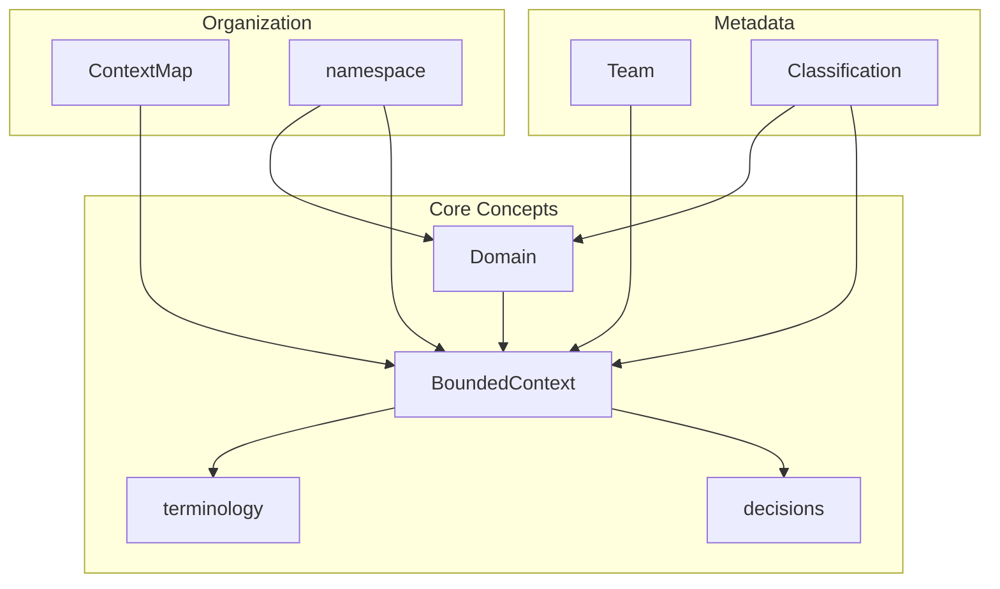

# DomainLang Quick Reference

Keep this cheat sheet open while you work. For detailed explanations, see the [Language Reference](./language.md).

> **📋 Audience:** All users who need quick syntax lookups while modeling. Perfect as a second-tab reference.

---

## At a Glance



---

## Basic Structure

```dlang
Domain DomainName {
    description: "What this domain does"
}

BC ContextName for DomainName {
    description: "What this context does"
}
```

## Keywords

| Concept | Keywords | Shorthand |
| ------- | -------- | --------- |
| Domain | `Domain` | — |
| Bounded Context | `BoundedContext` | `BC` |
| Team | `Team` | — |
| Classification | `Classification` | — |
| Context Map | `ContextMap` | — |
| Domain Map | `DomainMap` | — |
| Namespace | `namespace` | — |

---

## Inline Syntax

Write concise declarations with inline syntax:

```dlang
BC Orders for Sales as CoreDomain by SalesTeam {
    description: "Order processing"
}

// Equivalent to:
BC Orders for Sales {
    role: CoreDomain
    team: SalesTeam
    description: "Order processing"
}
```

---

## Documentation Blocks

Add metadata to your types:

```dlang
BC Orders for Sales {
    description: "Short description"

    terminology { term Order: "..." }
    language { term Order: "..." }      // alias for terminology
    glossary { term Order: "..." }      // alias for terminology

    decisions { decision [...]: "..." }
    constraints { ... }                 // alias for decisions
    rules { ... }                       // alias for decisions
    policies { ... }                    // alias for decisions

    relationships { A -> B }
    integrations { A -> B }             // alias for relationships
    connections { A -> B }              // alias for relationships

    classifications {
        role: CoreDomain
        businessModel: B2B
        lifecycle: CustomBuilt
    }
}
```

## Terminology

```dlang
terminology {
    term Product: "Item for sale"
        aka: SKU, Item                  // synonyms
        examples: "Laptop", "Mouse"     // concrete examples
}
```

## Classifications

```dlang
Classification CoreDomain
Classification SupportingDomain

Domain Sales {
    classification: CoreDomain
}

BC Orders for Sales {
    role: CoreDomain                    // context-specific
}
```

## Decisions, Policies, Rules

```dlang
// Declare classification categories first
Classification Architectural
Classification Business
Classification Compliance

// Use in decisions (category is a Classification reference)
decisions {
    decision EventSourcing: "Use event sourcing"
    decision [Architectural] UseKafka: "Use Kafka"
    decision [Business] FreeShipping: "Free shipping over $50"
    decision [Compliance] GDPR: "GDPR compliant"
}

policies {
    policy [Business] NoRefunds: "No refunds after 30 days"
}

rules {
    rule [Compliance] DataRetention: "Keep for 7 years"
}
```

## Context Maps

```dlang
ContextMap System {
    contains A, B, C                    // list all contexts

    // Simple relationships
    A -> B                              // upstream -> downstream
    A <- B                              // downstream <- upstream
    A <-> B                             // bidirectional
    A >< B                              // separate ways (no integration)

    // Named relationships
    A -> B : IntegrationName

    // With DDD patterns
    [OHS] A -> [ACL] B
    [SK] A <-> B : SharedKernel
}
```

---

## DDD Relationship Patterns

| Pattern | Meaning |
| ------- | ------- |
| `OHS` | Open Host Service |
| `ACL` | Anti-Corruption Layer |
| `PL` | Published Language |
| `SK` | Shared Kernel |
| `CF` | Conformist |
| `P` | Partnership |
| `BBoM` | Big Ball of Mud |
| `><` | Separate Ways (no integration) |

---

## Imports

```dlang
// Local file
import "./shared.dlang"
import "../parent.dlang"

// Workspace root
import "~/shared/core.dlang"

// With alias
import "./types.dlang" as Types

// Named imports
import { CoreDomain, Team } from "./shared.dlang"

// Git repository
import "owner/repo@v1.0.0" as External
import "owner/repo@main"
import "owner/repo@abc123"

// Manifest-based (defined in model.yaml)
import "ddd-patterns" as Patterns
```

## Namespaces

```dlang
// Namespace (hierarchical container)
namespace Shared {
    Classification CoreDomain
    Team ProductTeam
}

// Reference: Shared.CoreDomain, Shared.ProductTeam
```

## Assignment Operators

```dlang
BC Orders {
    description: "..."      // colon (recommended)
    team = SalesTeam         // equals
    role is CoreDomain       // is (natural language)
}
```

All three are equivalent. Use `:` for consistency.

## Domain Maps

```dlang
DomainMap Portfolio {
    contains Sales, Marketing, Support
}
```

## Domain Hierarchy

```dlang
Domain Enterprise { }

Domain Sales in Enterprise { }

Domain OrderManagement in Sales { }
```

---

## Alternative Keywords

These keywords are interchangeable:

| Primary | Alternatives |
| ------- | ------------ |
| `terminology` | `language`, `glossary` |
| `decisions` | `constraints`, `rules`, `policies` |
| `relationships` | `integrations`, `connections` |

---

## Self-Reference

Use `this` to refer to the containing context:

```dlang
BC Orders {
    relationships {
        this -> ExternalSystem      // self-reference
    }
}
```

---

## Comments

```dlang
// Line comment

/*
 * Block comment
 */
```

---

## Complete Minimal Example

Copy this starter template:

```dlang
Classification CoreDomain
Team ProductTeam

Domain ECommerce {
    description: "Online shopping"
}

BC Catalog for ECommerce as CoreDomain by ProductTeam {
    description: "Product catalog"

    terminology {
        term Product: "Item for sale"
    }
}

BC Orders for ECommerce as CoreDomain by ProductTeam {
    description: "Order management"
}

ContextMap Platform {
    contains Catalog, Orders
    Catalog -> Orders
}
```

## Common Patterns

### Strategic DDD

```dlang
// Define classifications
Classification CoreDomain
Classification SupportingDomain
Classification GenericDomain

// Apply to domains
Domain Sales {
    classification: CoreDomain
}

// Apply to contexts
BC Orders for Sales {
    role: CoreDomain
}
```

### Full Context Definition

```dlang
// Define classifications (including decision categories)
Classification CoreDomain
Classification Architectural
Classification Business
Classification Compliance

BC OrderManagement for Sales as CoreDomain by SalesTeam {
    description: "Process customer orders"

    terminology {
        term Order: "Customer purchase"
            aka: PurchaseOrder
            examples: "Order #12345"
    }

    classifications {
        role: CoreDomain
        businessModel: B2B
    }

    decisions {
        decision [Architectural] EventSourcing: "Track all changes"
        policy [Business] FreeShipping: "Free over $50"
        rule [Compliance] DataRetention: "7 years"
    }

    relationships {
        [OHS] this -> Catalog
    }
}
```

### Context Map with Patterns

```dlang
ContextMap Integration {
    contains Publisher, Subscriber, Legacy

    [OHS, PL] Publisher -> [ACL] Subscriber
    [SK] Publisher <-> Subscriber : SharedKernel
    [CF] Legacy -> Publisher
}
```

---

## 💡 Tips for Success

1. ✏️ **Use `BC` shorthand** — Saves typing over `BoundedContext`
2. 📝 **Use `:` for assignments** — Most readable and common style
3. 🔗 **Always associate contexts with domains** — Use `for DomainName`
4. 📖 **Define terminology** — Documents your ubiquitous language
5. ⚡ **Use inline syntax** — `as` and `by` make models concise
6. 🗺️ **Create context maps** — Visualize integration patterns
7. 🏷️ **Mark strategic importance** — Use classifications wisely
8. 📋 **Document decisions** — ADRs in code!
9. 📂 **Use namespaces** — Keep large models organized
10. ♻️ **Import reusable patterns** — Don't duplicate common definitions

---

## See Also

| Resource | Purpose |
| -------- | ------- |
| [Getting Started](./getting-started.md) | Step-by-step tutorial |
| [Syntax Examples](./syntax-examples.md) | Comprehensive examples |
| [Language Reference](./language.md) | Complete grammar specification |
| [Examples](../examples/) | Full domain models |
