# DomainLang Quick Reference

> Your syntax cheat sheet. Bookmark this page.

When you're deep in modeling and need to look something up fast, this is your go-to reference. For the "why" behind each construct, see the [Language Reference](./language.md).

---

## The Building Blocks

```mermaid
graph LR
    D["🏛 Domain"] --> BC["📦 Bounded Context"]
    BC --> T["📖 Terminology"]
    BC --> R["🔗 Relationships"]
    BC --> Dec["⚖️ Decisions"]
    
    Team["👥 Team"] -.->|owns| BC
    Class["🏷 Classification"] -.->|categorizes| BC
```



## Basic Structure

```dlang
Domain DomainName {
    description: "What this domain does"
}

bc ContextName for DomainName {
    description: "What this context does"
}
```

---

## Keywords at a Glance

| Concept | Keyword | Shorthand |
| ------- | ------- | --------- |
| Domain | `Domain` | `dom` |
| Bounded Context | `BoundedContext` | `bc` |
| Team | `Team` | — |
| Classification | `Classification` | — |
| Context Map | `ContextMap` | `cmap` |
| Domain Map | `DomainMap` | `dmap` |
| Namespace | `Namespace` | `ns` |
| Import | `Import` | `import` |

---

## Inline Syntax

Concise declarations using `as` (role) and `by` (team):

```dlang
Classification CoreDomain
Team SalesTeam
Domain Sales { description: "Sales domain" }

bc Orders for Sales as CoreDomain by SalesTeam {
    description: "Order processing"
}
```

Explicit property assignment (alternative):

```dlang
bc Orders for Sales {
    description: "Order processing"
    role: CoreDomain
    team: SalesTeam
}
```

---

## Documentation Blocks

```dlang
Classification CoreDomain
Classification B2B
Classification CustomBuilt

Domain Sales { description: "Sales domain" }
bc Payments for Sales { description: "Payments" }

bc Orders for Sales {
    description: "Short description"
    role: CoreDomain
    businessModel: B2B
    lifecycle: CustomBuilt
    
    relationships { Orders -> Payments }
    terminology { term Order: "A customer purchase order" }
    decisions { rule ValidPayment: "Orders must have valid payment" }
}
```

**Block aliases:**

| Primary | Aliases |
| ------- | ------- |
| `terminology` | `language`, `glossary` |
| `decisions` | `constraints`, `rules`, `policies` |
| `relationships` | `integrations`, `connections` |

---

## Metadata

```dlang
Metadata Language
Metadata Framework

bc PaymentService for Payments {
    metadata {
        Language: "Go"
        Framework: "Echo"
    }
}
```

---

## Terminology

```dlang
terminology {
    term Product: "Item for sale"
        aka: SKU, Item
        examples: "Laptop", "Mouse"
}
```

---

## Classifications

```dlang
Classification CoreDomain
Classification SupportingDomain
Classification B2B

// On domains
Domain Sales {
    classification: CoreDomain
}

// On contexts (inline)
bc Orders for Sales as CoreDomain { }

// On contexts (block)
bc Orders for Sales {
    role: CoreDomain
    businessModel: B2B
}
```

---

## Decisions & Policies

```dlang
Classification Architectural
Classification Business

bc Fulfillment for Orders {
    decisions {
        decision EventSourcing: "Use event sourcing"
        decision [Architectural] UseKafka: "Use Kafka"
        policy [Business] FreeShipping: "Free over $50"
    }
}
```

---

## Context Maps

```dlang
ContextMap System {
    contains CatalogService, OrderService, PaymentService

    // Upstream -> Downstream
    CatalogService -> OrderService
    
    // Bidirectional
    CatalogService <-> PaymentService

    // With DDD patterns
    [OHS] CatalogService -> [ACL] OrderService
    [SK] OrderService <-> PaymentService : SharedKernel
}
```

---

## DDD Relationship Patterns

These patterns describe *how* contexts integrate—crucial for managing complexity at boundaries:


| Pattern | Abbreviation | When to Use |
| ------- | ------------ | ----------- |
| Open Host Service | `OHS` | You provide a stable, documented API |
| Anti-Corruption Layer | `ACL` | Protect your model from external messiness |
| Published Language | `PL` | Well-documented interchange format |
| Shared Kernel | `SK` | Teams co-own a small shared model |
| Conformist | `CF` | You follow upstream's model as-is |
| Partnership | `P` | Two teams succeed or fail together |
| Big Ball of Mud | `BBoM` | Mark legacy systems honestly |
| Separate Ways | `><` | No integration needed |

---

## Imports

```dlang
// Local files
import "./shared.dlang"
import "~/shared/core.dlang"

// With alias
import "./types.dlang" as Types

// Named imports
import { CoreDomain } from "./shared.dlang"

// Git repository
import "owner/repo@v1.0.0" as External
```

---

## Namespaces

```dlang
Namespace Shared {
    Classification CoreDomain
    Team ProductTeam
}

// Reference: Shared.CoreDomain
```

---

## Domain Hierarchy

```dlang
Domain Enterprise { }
Domain Sales in Enterprise { }
Domain OrderManagement in Sales { }
```

---

## Self-Reference

Use `this` in relationship blocks:

```dlang
bc Orders for Sales {
    relationships {
        this -> ExternalSystem
    }
}
```

---

## Comments

```dlang
// Line comment

/* Block comment */
```

---

## Complete Minimal Example

```dlang
Classification CoreDomain
Team ProductTeam

Domain ECommerce {
    description: "Online shopping"
}

bc Catalog for ECommerce as CoreDomain by ProductTeam {
    description: "Product catalog"
    terminology {
        term Product: "Item for sale"
    }
}

bc Orders for ECommerce as CoreDomain by ProductTeam {
    description: "Order management"
}

ContextMap Platform {
    contains Catalog, Orders
    Catalog -> Orders
}
```

---

## 💡 Quick Tips

> **Pro moves** that will make your models cleaner:

| Instead of... | Do this |
| ------------- | ------- |
| `BoundedContext Orders` | `bc Orders` |
| `role: CoreDomain` in body | `as CoreDomain` inline |
| `team: SalesTeam` in body | `by SalesTeam` inline |
| `description = "..."` | `description: "..."` |

**Golden rules:**

- Every context needs `for DomainName` — always link to a domain
- Every context map needs `contains` — declare before you relate
- Every context benefits from `description` — future you will thank you

---

## See Also

| Resource | Purpose |
| -------- | ------- |
| [Getting Started](./getting-started.md) | Tutorial |
| [Syntax Examples](./syntax-examples.md) | More patterns |
| [Language Reference](./language.md) | Full grammar |
