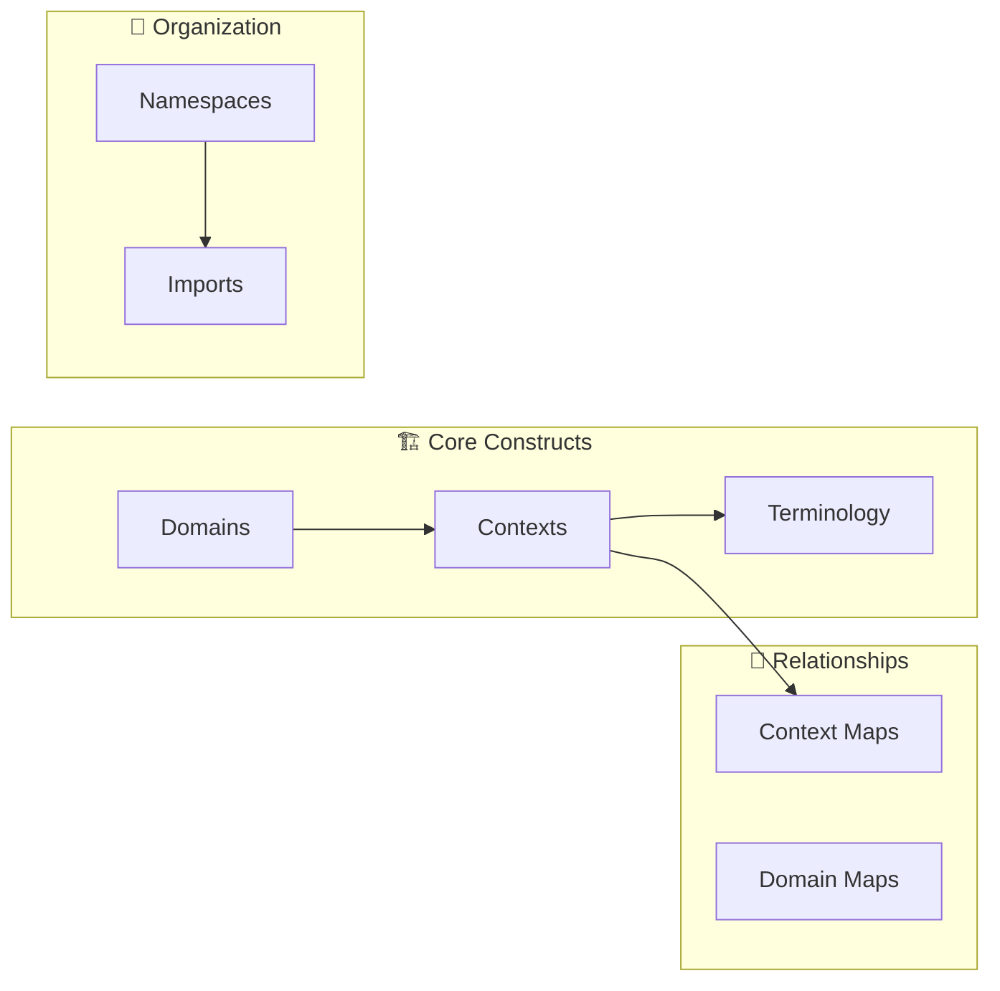

# DomainLang Syntax Examples

> Grab what you need. Every pattern in one place.

This is your cookbook—find the pattern, copy the code, adapt to your domain. No fluff, just working examples.

**First time here?** Start with the [Getting Started Guide](./getting-started.md) to understand the concepts.

---

## Quick Navigation



| Section | Jump to |
| ------- | ------- |
| Domains | [→ Domains](#domains) |
| Bounded Contexts | [→ Contexts](#bounded-contexts) |
| Classifications & Teams | [→ Teams](#classifications-and-teams) |
| Terminology | [→ Terms](#terminology) |
| Context Maps | [→ Maps](#context-maps) |
| Imports & Namespaces | [→ Imports](#imports) |
| Complete Example | [→ E-Commerce](#complete-real-world-example) |

---

## Domains

### Basic Domain

```dlang
Domain Sales {
    description: "Handles all sales operations"
}
```

### Domain with Vision

```dlang
Domain CustomerExperience {
    description: "Overall customer journey"
    vision: "Create seamless experiences from discovery to support"
}
```

### Domain with Classification

```dlang
Classification CoreDomain

Domain Sales {
    description: "Sales and revenue generation"
    classification: CoreDomain
}
```

### Nested Domains

```dlang
Domain Enterprise { description: "Top-level" }
Domain Sales in Enterprise { description: "Sales operations" }
Domain OrderManagement in Sales { description: "Order processing" }
```

---

## Bounded Contexts

### Basic Context

```dlang
Domain Sales { description: "Sales domain" }

BoundedContext OrderProcessing for Sales {
    description: "Process customer orders"
}
```

### Using `bc` Shorthand

```dlang
Domain Sales { description: "Sales domain" }

bc OrderProcessing for Sales {
    description: "Process customer orders"
}
```

### Context with Inline Classification and Team

```dlang
Classification CoreDomain
Team SalesTeam
Domain Sales { description: "Sales domain" }

bc OrderProcessing for Sales as CoreDomain by SalesTeam {
    description: "Process customer orders"
}
```

### Context with Block Properties

```dlang
Classification CoreDomain
Classification EventSourced
Team SalesTeam
Domain Sales { description: "Sales domain" }

bc OrderProcessing for Sales {
    description: "Process customer orders"
    role: CoreDomain
    team: SalesTeam
    businessModel: EventSourced
}
```

---

## Classifications and Teams

```dlang
// Classifications
Classification CoreDomain
Classification SupportingDomain
Classification GenericDomain

// Teams
Team ProductTeam
Team PlatformTeam
Team InfrastructureTeam

// In namespaces
Namespace StrategicPatterns {
    Classification CoreDomain
    Classification SupportingDomain
}

Namespace Engineering {
    Team BackendTeam
    Team FrontendTeam
}
```

---

## Metadata

```dlang
Metadata Language
Metadata Framework
Metadata Database
Metadata Owner

Domain Platform { description: "Platform" }

bc PaymentService for Platform {
    description: "Payment processing"
    
    metadata {
        Language: "Go"
        Framework: "Echo"
        Database: "PostgreSQL"
        Owner: "Payments Team"
    }
}
```

---

## Terminology

### Basic Terms

```dlang
terminology {
    term Order: "Customer purchase request"
    term Invoice: "Bill sent to customer"
}
```

### Terms with Synonyms and Examples

```dlang
terminology {
    term Order: "Customer purchase request"
        aka: PurchaseOrder, CustomerOrder
        examples: "Order #12345", "Order #67890"
        
    term Product: "Item available for purchase"
        aka: SKU, Item
        examples: "Laptop", "Mouse"
}
```

---

## Context Maps

Context maps visualize how your bounded contexts integrate. Think of them as the wiring diagram for your system:

```mermaid
graph LR
    subgraph Upstream
        A[\"📦 Publisher<br/>OHS\"]
    end
    
    subgraph Downstream
        B[\"📦 Subscriber<br/>ACL\"]
    end
    
    A -->|\"publishes to\"| B
    
    style A fill:#e8f5e9
    style B fill:#fff3e0
```

### Basic Context Map

```dlang
ContextMap SalesSystem {
    contains Catalog, Orders
    Catalog -> Orders
}
```

### With Relationship Types

```dlang
ContextMap SalesSystem {
    contains Catalog, Orders
    Catalog -> Orders : UpstreamDownstream
}
```

### With DDD Patterns

```dlang
ContextMap System {
    contains Publisher, Subscriber, Legacy

    // Open Host Service + Anti-Corruption Layer
    [OHS] Publisher -> [ACL] Subscriber
    
    // Shared Kernel (bidirectional)
    [SK] Publisher <-> Subscriber : SharedKernel
    
    // Conformist
    [CF] Legacy -> Publisher
    
    // Separate Ways (no integration)
    Publisher >< Legacy
}
```

### Self-Reference with `this`

```dlang
bc Sales for Platform {
    relationships {
        [OHS] this -> ExternalSystem
    }
}
```

---

## Domain Maps

```dlang
Domain Sales { description: "Sales" }
Domain Marketing { description: "Marketing" }
Domain Support { description: "Support" }

DomainMap CustomerFacing {
    contains Sales, Marketing, Support
}
```

---

## Decisions, Policies, and Rules

```dlang
Classification Architectural
Classification Business
Classification Compliance

bc Orders for Sales {
    decisions {
        // Decisions
        decision EventSourcing: "Use event sourcing"
        decision [Architectural] UseKafka: "Use Kafka for messaging"
        
        // Policies
        policy [Business] FreeShipping: "Free shipping over $50"
        policy [Business] ReturnWindow: "30-day return window"
        
        // Rules
        rule [Compliance] DataRetention: "Store data for 7 years"
        rule [Business] MinimumOrder: "Minimum order is $10"
    }
}
```

---

## Imports

### Local Files

```dlang
import "./shared/classifications.dlang"
import "../domains/customer.dlang"
```

### Workspace Root

```dlang
import "~/contexts/sales.dlang"
import "~/shared/patterns.dlang"
```

### With Alias

```dlang
import "./shared/classifications.dlang" as Shared

bc Orders for Sales as Shared.CoreDomain { }
```

### Git Repositories

```dlang
import "ddd-patterns/core@v2.1.0" as DDDPatterns
import "ddd-patterns/core@main"
import "ddd-patterns/core@abc123def456"
```

### Named Imports

```dlang
import { CoreDomain, SupportingDomain } from "./classifications.dlang"
```

---

## Namespaces

### Basic Namespace

```dlang
Namespace Shared {
    Classification CoreDomain
    Team PlatformTeam
}

// Reference: Shared.CoreDomain, Shared.PlatformTeam
```

### Nested Namespaces

```dlang
Namespace Company {
    Namespace Engineering {
        Team BackendTeam
        Team FrontendTeam
    }
}

// Reference: Company.Engineering.BackendTeam
```

### Qualified Namespace

```dlang
Namespace acme.sales {
    Domain Sales { description: "Sales domain" }
    bc Orders for Sales { description: "Orders" }
}

// FQNs: acme.sales.Sales, acme.sales.Orders
```

---

## Complete Real-World Example

```dlang
// ============================================================================
// E-Commerce Platform - Strategic Classifications
// ============================================================================

Classification CoreDomain
Classification SupportingDomain
Classification GenericDomain

// Decision categories (for governance)
Classification Architectural
Classification Business
Classification Compliance

// ============================================================================
// E-Commerce Platform - Teams
// ============================================================================

Team ProductTeam
Team CheckoutTeam
Team FulfillmentTeam
Team DataTeam

// ============================================================================
// E-Commerce Platform - Domain Hierarchy
// ============================================================================

Domain EcommercePlatform {
    description: "Complete e-commerce platform"
    vision: "Enable seamless online shopping experiences"
    classification: CoreDomain
}

Domain CustomerExperience in EcommercePlatform {
    description: "Customer-facing capabilities"
    classification: CoreDomain
}

Domain BackOffice in EcommercePlatform {
    description: "Internal operations and management"
    classification: SupportingDomain
}

// ============================================================================
// E-Commerce Platform - Core Bounded Contexts
// ============================================================================

bc ProductCatalog for CustomerExperience as CoreDomain by ProductTeam {
    description: "Manages product catalog, search, and discovery"

    terminology {
        term Product: "Item available for purchase"
            aka: SKU, Item
            examples: "Laptop", "Mouse"

        term Category: "Product classification"
            examples: "Electronics", "Books"

        term Inventory: "Available stock quantity"
            aka: Stock
    }

    decisions {
        decision [Architectural] UseElasticsearch: "Use Elasticsearch for product search"
        policy [Business] NoDiscontinuedProducts: "Remove old products after 30 days"
    }
}

bc ShoppingCart for CustomerExperience as CoreDomain by CheckoutTeam {
    description: "Manages customer shopping carts"

    terminology {
        term Cart: "Temporary product collection"
            aka: Basket
        term CartItem: "Single product in cart"
        term AbandonedCart: "Inactive cart over 24 hours"
    }

    decisions {
        policy [Business] CartExpiration: "Expire carts after 7 days"
    }
}

bc Checkout for CustomerExperience as CoreDomain by CheckoutTeam {
    description: "Order capture and payment orchestration"

    relationships {
        [CF] this -> PaymentGateway
        [OHS] this -> ShoppingCart
    }

    terminology {
        term CheckoutSession: "Customer purchase flow"
        term PaymentMethod: "Customer payment option"
        term Order: "Confirmed purchase"
    }

    decisions {
        decision [Architectural] EventSourcing: "Record every checkout step"
        policy [Business] FreeShippingOver50: "Free shipping for orders over $50"
        rule [Compliance] PCI_DSS: "Comply with PCI-DSS"
    }
}

bc OrderManagement for BackOffice as CoreDomain by FulfillmentTeam {
    description: "Order lifecycle and fulfillment"

    terminology {
        term Order: "Confirmed purchase"
        term OrderLine: "Product in order"
        term Fulfillment: "Order preparation and shipping"
    }

    decisions {
        policy [Business] NoBackorders: "Reject orders without inventory"
    }
}

bc PaymentGateway for CustomerExperience as SupportingDomain by CheckoutTeam {
    description: "Payment service provider integration"

    terminology {
        term PaymentIntent: "Initiated payment"
        term PaymentConfirmation: "Successful payment"
        term Refund: "Payment return"
    }
}

bc Analytics for BackOffice as GenericDomain by DataTeam {
    description: "Business intelligence and reporting"

    terminology {
        term ConversionRate: "Percentage of customers who purchase"
        term AverageOrderValue: "Average purchase amount"
    }
}

// ============================================================================
// E-Commerce Platform - Context Maps
// ============================================================================

ContextMap CustomerJourney {
    contains ProductCatalog, ShoppingCart, Checkout, PaymentGateway

    ProductCatalog -> ShoppingCart
    ShoppingCart -> Checkout
    Checkout -> PaymentGateway
}

ContextMap OrderFulfillment {
    contains Checkout, OrderManagement, PaymentGateway

    Checkout -> OrderManagement
    OrderManagement -> PaymentGateway
}

ContextMap BusinessIntelligence {
    contains ProductCatalog, Checkout, OrderManagement, Analytics

    ProductCatalog -> Analytics
    Checkout -> Analytics
    OrderManagement -> Analytics
}

// ============================================================================
// E-Commerce Platform - Domain Portfolio
// ============================================================================

DomainMap PlatformOverview {
    contains EcommercePlatform, CustomerExperience, BackOffice
}
```

---

## Assignment Operator Styles

DomainLang supports three assignment operators interchangeably.

### Colon `:` (JSON/YAML Style)

```dlang
bc Orders for Sales {
    description: "Order processing"
    role: CoreDomain
}
```

### Equals `=` (Traditional Programming)

```dlang
bc Orders for Sales {
    description = "Order processing"
    role = CoreDomain
}
```

### Is (Natural Language)

```dlang
bc Orders for Sales {
    description is "Order processing"
    role is CoreDomain
}
```

**Recommendation:** Use `:` for consistency with JSON/YAML. The grammar accepts all three, but `:` is most common in DSLs.

---

## Comments

### Line Comments

```dlang
// This is a line comment
Domain Sales {
    description: "Sales domain"  // Another comment
}
```

### Block Comments

```dlang
/*
 * Multi-line comment
 * explaining complex logic
 */
Domain Sales {
    description: "Sales domain"
}
```

---

## Summary

This document demonstrated every syntactic feature of DomainLang:

| Feature | Description |
| ------- | ----------- |
| **Domains** | Strategic business areas with hierarchy |
| **Bounded Contexts** | Model boundaries with full documentation |
| **Classifications** | Reusable strategic patterns |
| **Teams** | Ownership tracking |
| **Terminology** | Ubiquitous language with synonyms and examples |
| **Context Maps** | Relationship patterns (OHS, ACL, SK, etc.) |
| **Domain Maps** | Portfolio visualization |
| **Decisions, Policies, Rules** | Governance documentation |
| **Imports** | Local, workspace, and Git-based sharing |
| **Namespaces** | Hierarchical organization |

---

## See Also

| Resource | Purpose |
| -------- | ------- |
| [Getting Started Guide](./getting-started.md) | Beginner tutorial |
| [Language Reference](./language.md) | Formal syntax specification |
| [Grammar Review](./design-docs/GRAMMAR_REVIEW_2025.md) | Design decisions and rationale |
