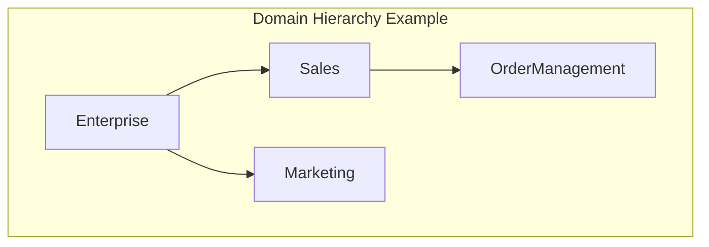
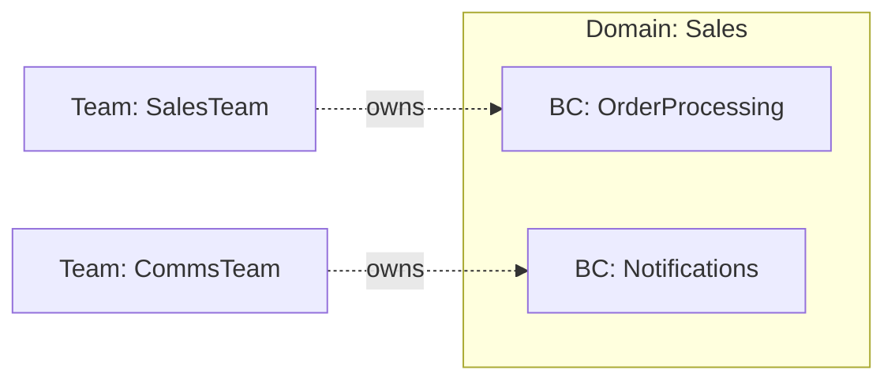
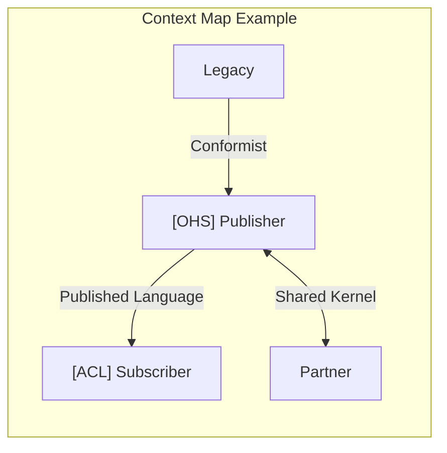

# DomainLang Syntax Examples

This guide provides copy-paste examples for every language feature. Use it as a reference when you need to implement specific patterns.

> **📋 Audience:** All skill levels seeking ready-to-use code snippets. Great for copy-paste workflows and learning by example.

> **New to DomainLang?** Start with the [Getting Started Guide](./getting-started.md) for a hands-on tutorial.

---

## Table of Contents

- [Domains](#domains)
- [Bounded Contexts](#bounded-contexts)
- [Classifications and Teams](#classifications-and-teams)
- [Metadata](#metadata)
- [Terminology](#terminology)
- [Context Maps](#context-maps)
- [Domain Maps](#domain-maps)
- [Context Groups](#context-groups)
- [Decisions, Policies, and Rules](#decisions-policies-and-rules)
- [Imports](#imports)
- [Namespaces](#namespaces)
- [Complete Real-World Example](#complete-real-world-example)

---

## Domains

Domains represent spheres of knowledge, influence, or activity in your business.



### Basic Domain

```dlang
Domain Sales {
    description: "Handles all sales operations"
}
```

### Domain with Vision

```dlang
Domain CustomerExperience {
    description: "Overall customer journey"
    vision: "Create seamless experiences from discovery to support"
}
```

### Domain with Classification

```dlang
Classification CoreDomain

Domain Sales {
    description: "Sales and revenue generation"
    classification: CoreDomain
}
```

### Nested Domains (Subdomains)

```dlang
Domain Enterprise {
    description: "Enterprise portfolio"
}

Domain Sales in Enterprise {
    description: "Sales operations"
}

Domain Marketing in Enterprise {
    description: "Marketing campaigns"
}
```

### Multiple Levels of Nesting

```dlang
Domain Enterprise {
    description: "Top-level enterprise"
}

Domain CustomerFacing in Enterprise {
    description: "Customer-facing domains"
}

Domain Sales in CustomerFacing {
    description: "Sales and revenue"
}

Domain OrderManagement in Sales {
    description: "Order processing and fulfillment"
}
```

---

## Bounded Contexts

Bounded Contexts are boundaries within which a specific domain model is defined. Each context owns its model and terminology.



### Basic Bounded Context

```dlang
Domain Sales {
    description: "Sales domain"
}

BoundedContext OrderProcessing for Sales {
    description: "Process customer orders"
}
```

### Using Shorthand `BC`

```dlang
bc OrderProcessing for Sales {
    description: "Process customer orders"
}
```

### Context with Classification

```dlang
Classification CoreDomain
Classification SupportingDomain

bc OrderProcessing for Sales as CoreDomain {
    description: "Core order processing logic"
}

bc Notifications for Sales as SupportingDomain {
    description: "Send order notifications"
}
```

### Context with Team Ownership

```dlang
Team SalesTeam

bc OrderProcessing for Sales by SalesTeam {
    description: "Process customer orders"
}
```

### Context with Multiple Properties (Inline)

```dlang
Classification CoreDomain
Team SalesTeam

bc OrderProcessing for Sales as CoreDomain by SalesTeam {
    description: "Process customer orders"
}
```

### Context with Multiple Classifications

```dlang
Classification CoreDomain
Classification EventSourced
Classification HighTraffic

bc OrderProcessing for Sales {
    description: "Process customer orders"

    classifications {
        role: CoreDomain
        businessModel: EventSourced
        lifecycle: HighTraffic
    }
}
```

---

## Classifications and Teams

### Basic Classification

```dlang
Classification CoreDomain
Classification SupportingDomain
Classification GenericDomain
```

### Classification in Namespaces

```dlang
Namespace StrategicPatterns {
    Classification CoreDomain
    Classification SupportingDomain
    Classification GenericDomain
}
```

### Teams

```dlang
Team ProductTeam
Team PlatformTeam
Team InfrastructureTeam
```

### Teams in Namespaces

```dlang
Namespace Engineering {
    Team BackendTeam
    Team FrontendTeam
    Team DataTeam
}
```

---

## Terminology

Document the ubiquitous language within bounded contexts.

### Basic Terms

```dlang
bc OrderProcessing for Sales {
    terminology {
        term Order: "Customer purchase request"
        term Invoice: "Bill sent to customer"
        term Payment: "Money received from customer"
    }
}
```

### Terms with Synonyms

```dlang
terminology {
    term Order: "Customer purchase request"
        aka: PurchaseOrder, CustomerOrder

    term Invoice: "Bill sent to customer"
        aka: BillingOrder
}
```

### Terms with Examples

```dlang
terminology {
    term Product: "Item available for purchase"
        examples: "Laptop #12345", "Mouse #67890"

    term Customer: "Person making a purchase"
        examples: "john@example.com", "jane@example.com"
}
```

### Terms with Both Synonyms and Examples

```dlang
terminology {
    term Order: "Customer purchase request"
        aka: PurchaseOrder, CustomerOrder
        examples: "Order #12345", "Order #67890"
}
```

### Alternative Block Names

```dlang
// All of these are equivalent for terminology
bc Sales for Domain1 {
    terminology { ... }
}

bc Sales for Domain1 {
    language { ... }
}

bc Sales for Domain1 {
    glossary { ... }
}
```

---

## Context Maps

Context Maps show relationships between bounded contexts.



### Basic Context Map

```dlang
bc Catalog for Sales {
    description: "Product catalog"
}

bc Orders for Sales {
    description: "Order management"
}

ContextMap SalesSystem {
    contains Catalog, Orders
}
```

### Context Map with Relationships

```dlang
ContextMap SalesSystem {
    contains Catalog, Orders

    Catalog -> Orders
}
```

### Relationships with Names

```dlang
ContextMap SalesSystem {
    contains Catalog, Orders

    Catalog -> Orders : ProductLookup
}
```

### Upstream/Downstream Patterns

```dlang
ContextMap System {
    contains Upstream, Downstream

    // Upstream influences downstream
    Upstream -> Downstream

    // Alternative: Downstream depends on upstream
    Downstream <- Upstream
}
```

### Bidirectional Relationships

```dlang
ContextMap System {
    contains ContextA, ContextB

    // Mutual dependency
    ContextA <-> ContextB : SharedKernel
}
```

### Relationship Roles (DDD Patterns)

```dlang
ContextMap System {
    contains Publisher, Subscriber, Conformist, AntiCorruption

    // Open Host Service (OHS) with Published Language (PL)
    [OHS, PL] Publisher -> Subscriber : PublicAPI

    // Conformist (CF) - downstream conforms to upstream
    [CF] Conformist -> Publisher : ConformistIntegration

    // Anti-Corruption Layer (ACL) - protects downstream
    Publisher -> [ACL] AntiCorruption : ProtectedIntegration
}
```

### All Relationship Roles

```dlang
ContextMap Patterns {
    contains A, B, C, D, E, F, G

    // PL: Published Language
    [PL] A -> B

    // OHS: Open Host Service
    [OHS] A -> C

    // CF: Conformist
    [CF] D -> A

    // ACL: Anti-Corruption Layer
    A -> [ACL] E

    // P: Partnership (or just partner)
    [P] F <-> G

    // SK: Shared Kernel
    [SK] A <-> B

    // BBoM: Big Ball of Mud (legacy code smell)
    [BBoM] C <-> D
}
```

### Customer/Supplier Pattern

```dlang
ContextMap CustomerSupplier {
    contains Supplier, Customer

    // Upstream/downstream relationship
    Supplier -> Customer

    // With explicit type label
    Supplier -> Customer : CustomerSupplier
}
```

### Separate Ways Pattern

```dlang
ContextMap Independent {
    contains A, B

    A >< B : SeparateWays
}
```

### Self-Referential with `this`

```dlang
bc Sales for Domain1 {
    relationships {
        [OHS] this -> ExternalSystem : PublicAPI
    }
}
```

---

## Domain Maps

Domain Maps show domain portfolios without integration details.

### Basic Domain Map

```dlang
Domain Sales { description: "Sales domain" }
Domain Marketing { description: "Marketing domain" }
Domain Support { description: "Support domain" }

DomainMap CustomerFacing {
    contains Sales, Marketing, Support
}
```

### Domain Map with Nested Domains

```dlang
Domain Enterprise { description: "Enterprise" }
Domain Sales in Enterprise { description: "Sales" }
Domain Marketing in Enterprise { description: "Marketing" }

DomainMap EnterprisePortfolio {
    contains Enterprise, Sales, Marketing
}
```

---

## Context Groups

Context Groups cluster contexts by strategic intent.

### Basic Context Group

## Decisions, Policies, and Rules

Document governance, architectural decisions, and business rules.

### Decisions

```dlang
bc Orders for Sales {
    decisions {
        decision EventSourcing: "Use event sourcing for order history"
        decision MicroserviceArchitecture: "Deploy as independent microservices"
    }
}
```

### Decisions with Classification Categories

Decision categories reference declared `Classification` types:

```dlang
// First declare your classification vocabulary
Classification Architectural
Classification Technical
Classification Business
Classification Compliance
Classification Security

// Then reference them in decisions
decisions {
    decision [Architectural] EventSourcing: "Use event sourcing"
    decision [Technical] UseKafka: "Use Kafka for event bus"
    decision [Business] NoRefundsAfter30Days: "No refunds after 30 days"
    decision [Compliance] GDPR: "Comply with GDPR regulations"
    decision [Security] EncryptPII: "Encrypt all PII data"
}
```

### Policies

```dlang
Classification Business

bc Orders for Sales {
    decisions {
        policy [Business] FreeShipping: "Free shipping over $50"
        policy [Business] ReturnWindow: "30-day return window"
    }
}
```

### Rules

```dlang
Classification Compliance
Classification Business

bc Orders for Sales {
    decisions {
        rule [Compliance] DataRetention: "Store data for 7 years"
        rule [Business] MinimumOrder: "Minimum order value is $10"
    }
}
```

### Decision Block Aliases

```dlang
// All equivalent for governance documentation
decisions { ... }
constraints { ... }
rules { ... }
policies { ... }
```

---

## Imports

Share and reuse domain models across files and repositories.

### Local File Imports

```dlang
// Relative to current file
import "./shared/classifications.dlang"
import "../domains/customer.dlang"
```

### Workspace-Relative Imports

```dlang
// ~ refers to workspace root
import "~/contexts/sales.dlang"
import "~/shared/patterns.dlang"
```

### Import with Alias

```dlang
import "./shared/types.dlang" as SharedTypes
import "~/domains/sales.dlang" as SalesDomain

// Use with qualified names
bc Orders for SalesDomain.Sales {
    classification: SharedTypes.CoreDomain
}
```

### GitHub Repository Imports

```dlang
// Owner/repo shorthand with version tag
import "ddd-patterns/core@v2.1.0" as DDDPatterns

// Pin to specific commit
import "ddd-patterns/core@abc123def456"

// Use main branch (development)
import "ddd-patterns/core"

// Use patterns
bc Orders for Sales {
    classifications {
        role: DDDPatterns.AggregateRoot
    }
}
```

### GitLab Imports

```dlang
import "https://gitlab.com/company/shared-domains@v1.0.0" as SharedDomains
```

### Bitbucket Imports

```dlang
import "https://bitbucket.org/team/domain-models@release-2.0" as DomainModels
```

### Named Imports (Planned Feature)

```dlang
// Future syntax - not yet implemented
// import { AggregatePattern, EntityPattern } from "ddd-patterns/core@v2.1.0"
```

---

## Namespaces

Organize large models with namespaces.

### Basic Namespace

```dlang
Namespace Shared {
    Classification CoreDomain
    Classification SupportingDomain
    Team PlatformTeam
}

// Reference with qualified names
bc Orders for Sales as Shared.CoreDomain by Shared.PlatformTeam {
    description: "Order processing"
}
```

### Nested Namespaces

```dlang
Namespace Company {
    Namespace Engineering {
        Team BackendTeam
        Team FrontendTeam
    }

    Namespace BusinessDevelopment {
        Team SalesTeam
        Team MarketingTeam
    }
}

bc Orders for Sales by Company.Engineering.BackendTeam {
    description: "Owned by backend team"
}
```

### Namespace with Qualified Name

```dlang
Namespace acme.sales {
    Domain Sales {
        description: "Sales domain"
    }

    bc Orders for Sales {
        description: "Order processing"
    }
}

// Fully qualified: acme.sales.Sales, acme.sales.Orders
```

### Namespace with Shared Resources

```dlang
Namespace acme.platform {
    Namespace Shared {
        Classification CoreDomain
        Team PlatformGuild
    }

    Domain Sales {
        description: "Sales domain"
        classification: Shared.CoreDomain
    }

    bc Orders for Sales by Shared.PlatformGuild {
        description: "Order processing"
    }
}
```

---

## Complete Real-World Example

A comprehensive e-commerce platform model demonstrating all features:

```dlang
// ============================================================================
// E-Commerce Platform Model
// ============================================================================

// Import shared patterns from external repository
import "ddd-patterns/core@v2.1.0" as Patterns
import "~/shared/compliance.dlang" as Compliance

// ============================================================================
// Strategic Classifications
// ============================================================================

Namespace StrategicClassifications {
    Classification CoreDomain
    Classification SupportingDomain
    Classification GenericDomain
}

// ============================================================================
// Teams
// ============================================================================

Namespace OrganizationStructure {
    Team ProductTeam
    Team CheckoutTeam
    Team FulfillmentTeam
    Team DataTeam
}

// ============================================================================
// Domain Hierarchy
// ============================================================================

Domain EcommercePlatform {
    description: "Complete e-commerce platform"
    vision: "Enable seamless online shopping experiences"
    classification: StrategicClassifications.CoreDomain
}

Domain CustomerExperience in EcommercePlatform {
    description: "Customer-facing capabilities"
    classification: StrategicClassifications.CoreDomain
}

Domain BackOffice in EcommercePlatform {
    description: "Internal operations and management"
    classification: StrategicClassifications.SupportingDomain
}

// ============================================================================
// Core Bounded Contexts
// ============================================================================

bc ProductCatalog for CustomerExperience
    as StrategicClassifications.CoreDomain
    by OrganizationStructure.ProductTeam {

    description: "Manages product catalog, search, and discovery"

    terminology {
        term Product: "Item available for purchase"
            aka: SKU, Item
            examples: "Laptop #12345", "Wireless Mouse #67890"

        term Category: "Product classification"
            examples: "Electronics", "Books", "Clothing"

        term Inventory: "Available stock quantity"
            aka: Stock, Availability
    }

    classifications {
        role: StrategicClassifications.CoreDomain
        businessModel: Patterns.AggregateRoot
        lifecycle: Compliance.HighTraffic
    }

    decisions {
        decision [architectural] ElasticsearchForSearch:
            "Use Elasticsearch for product search and filtering"

        decision [technical] CachingStrategy:
            "Cache product data in Redis for 5 minutes"

        policy [business] NoDiscontinuedProducts:
            "Remove discontinued products from search after 30 days"

        rule [compliance] ProductDataRetention:
            "Retain product history for 7 years for audit"
    }
}

bc ShoppingCart for CustomerExperience
    as StrategicClassifications.CoreDomain
    by OrganizationStructure.CheckoutTeam {

    description: "Manages customer shopping carts and cart abandonment"

    terminology {
        term Cart: "Temporary collection of products before checkout"
            aka: Basket, ShoppingBasket

        term CartItem: "Single product in a cart with quantity"

        term AbandonedCart: "Cart inactive for over 24 hours"
    }

    decisions {
        decision [technical] SessionStorage:
            "Store carts in Redis with 7-day TTL"

        policy [business] CartExpiration:
            "Expire carts after 7 days of inactivity"
    }
}

bc Checkout for CustomerExperience
    as StrategicClassifications.CoreDomain
    by OrganizationStructure.CheckoutTeam {

    description: "Handles checkout process and payment orchestration"

    terminology {
        term CheckoutSession: "Customer journey from cart to payment"
            aka: PurchaseFlow

        term PaymentMethod: "Customer's chosen payment option"
            examples: "Credit Card", "PayPal", "Apple Pay"

        term Order: "Confirmed purchase after successful payment"
    }

    classifications {
        role: StrategicClassifications.CoreDomain
        businessModel: Patterns.EventSourced
    }

    decisions {
        decision [architectural] EventSourcing:
            "Use event sourcing to track every step of checkout"

        decision [technical] SagaPattern:
            "Use saga pattern for distributed transaction management"

        policy [business] FreeShippingOver50:
            "Free shipping for orders over $50"

        rule [compliance] PCI_DSS:
            "Comply with PCI-DSS for payment card data"
    }

    relationships {
        [CF] this -> PaymentGateway
        [OHS] this -> ShoppingCart
    }
}

bc OrderManagement for BackOffice
    as StrategicClassifications.CoreDomain
    by OrganizationStructure.FulfillmentTeam {

    description: "Manages order lifecycle and fulfillment"

    terminology {
        term Order: "Confirmed customer purchase"
        term OrderLine: "Individual product in an order"
        term Fulfillment: "Process of preparing and shipping order"
        term TrackingNumber: "Shipment tracking identifier"
    }

    decisions {
        policy [business] NoBackorders:
            "Reject orders without available inventory"

        rule [business] OrderCancellationWindow:
            "Allow cancellations within 1 hour of order placement"
    }
}

bc PaymentGateway for CustomerExperience
    as StrategicClassifications.SupportingDomain
    by OrganizationStructure.CheckoutTeam {

    description: "Integration with payment service providers"

    terminology {
        term PaymentIntent: "Initiated payment request"
        term PaymentConfirmation: "Successful payment response"
        term Refund: "Return of payment to customer"
    }
}

bc Analytics for BackOffice
    as StrategicClassifications.GenericDomain
    by OrganizationStructure.DataTeam {

    description: "Business intelligence and reporting"

    terminology {
        term ConversionRate: "Percentage of visitors who make a purchase"
        term AverageOrderValue: "Average value of completed orders"
    }
}

// ============================================================================
// Context Maps
// ============================================================================

ContextMap CustomerJourney {
    contains ProductCatalog, ShoppingCart, Checkout, PaymentGateway

    // Product catalog provides data to shopping cart
    [OHS, PL] ProductCatalog -> [ACL] ShoppingCart

    // Shopping cart feeds checkout process
    ShoppingCart -> Checkout

    // Checkout orchestrates payment
    [CF] Checkout -> PaymentGateway
}

ContextMap OrderFulfillment {
    contains Checkout, OrderManagement, PaymentGateway

    // Successful checkout creates order
    Checkout -> OrderManagement

    // Order management can refund via payment gateway
    OrderManagement -> PaymentGateway
}

ContextMap BusinessIntelligence {
    contains ProductCatalog, Checkout, OrderManagement, Analytics

    // Analytics consumes data from operational contexts
    ProductCatalog -> Analytics
    Checkout -> Analytics
    OrderManagement -> Analytics
}

// ============================================================================
// Domain Portfolio
// ============================================================================

DomainMap PlatformOverview {
    contains EcommercePlatform, CustomerExperience, BackOffice
}
```

---

## Assignment Operator Styles

DomainLang supports three assignment operators interchangeably.

### Colon `:` (JSON/YAML Style)

```dlang
bc Orders for Sales {
    description: "Order processing"
    role: CoreDomain
}
```

### Equals `=` (Traditional Programming)

```dlang
bc Orders for Sales {
    description = "Order processing"
    role = CoreDomain
}
```

### Is (Natural Language)

```dlang
bc Orders for Sales {
    description is "Order processing"
    role is CoreDomain
}
```

**Recommendation:** Use `:` for consistency with JSON/YAML. The grammar accepts all three, but `:` is most common in DSLs.

---

## Comments

### Line Comments

```dlang
// This is a line comment
Domain Sales {
    description: "Sales domain"  // Another comment
}
```

### Block Comments

```dlang
/*
 * Multi-line comment
 * explaining complex logic
 */
Domain Sales {
    description: "Sales domain"
}
```

---

## Summary

This document demonstrated every syntactic feature of DomainLang:

| Feature | Description |
| ------- | ----------- |
| **Domains** | Strategic business areas with hierarchy |
| **Bounded Contexts** | Model boundaries with full documentation |
| **Classifications** | Reusable strategic patterns |
| **Teams** | Ownership tracking |
| **Terminology** | Ubiquitous language with synonyms and examples |
| **Context Maps** | Relationship patterns (OHS, ACL, SK, etc.) |
| **Domain Maps** | Portfolio visualization |
| **Decisions, Policies, Rules** | Governance documentation |
| **Imports** | Local, workspace, and Git-based sharing |
| **Namespaces** | Hierarchical organization |

---

## See Also

| Resource | Purpose |
| -------- | ------- |
| [Getting Started Guide](./getting-started.md) | Beginner tutorial |
| [Language Reference](./language.md) | Formal syntax specification |
| [Grammar Review](./design-docs/GRAMMAR_REVIEW_2025.md) | Design decisions and rationale |
